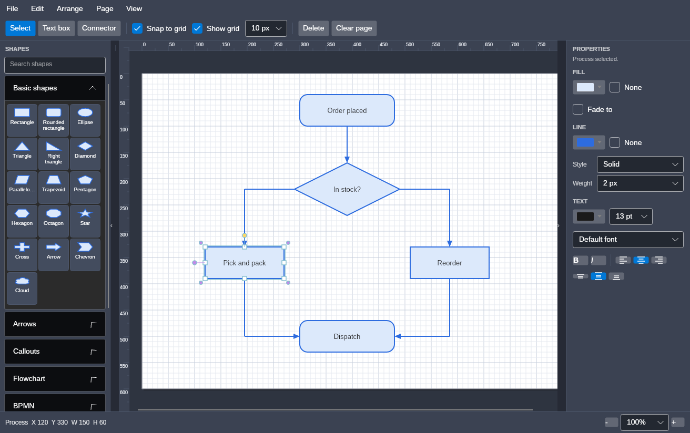
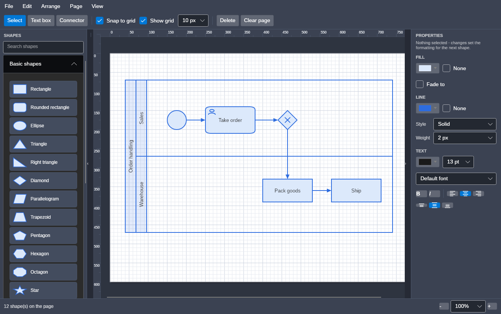

# AVASvgMaker

A Visio-style diagram editor built with **Avalonia UI** and **.NET 9**. Drag shapes from a
stencil toolbox onto a page-like canvas, label them, wire them together with connectors that
route themselves around whatever is in the way, and save or export the result.



Built in the same style as AVALander - no MVVM framework, just custom `Control` subclasses
that render themselves.

## Download

**[Latest release](https://github.com/Harlock123/AVASvgMaker/releases/latest)** - one
self-contained executable per platform. Nothing to install: the .NET runtime and Avalonia's
native libraries are inside the file.

| Platform | Download |
|---|---|
| Windows, Intel and AMD | `AVASvgMaker-`*`version`*`-win-x64.zip` |
| Windows on ARM | `AVASvgMaker-`*`version`*`-win-arm64.zip` |
| macOS, Apple silicon | `AVASvgMaker-`*`version`*`-osx-arm64.tar.gz` |
| macOS, Intel | `AVASvgMaker-`*`version`*`-osx-x64.tar.gz` |
| Linux, Intel and AMD | `AVASvgMaker-`*`version`*`-linux-x64.tar.gz` |
| Linux on ARM | `AVASvgMaker-`*`version`*`-linux-arm64.tar.gz` |

The tarballs keep the executable bit; if it goes missing on the way, `chmod +x AVASvgMaker`.
macOS will also want the binary cleared from quarantine before it will open something
downloaded from the web.

Or [build it yourself](#building).

## Features

**Drawing**

- **96 stencils** - basic shapes, arrows, callouts, a full flowchart set, BPMN, UML and network, in categories that fold away, with a search box
- **Page-like canvas** - a page floating on a workspace, with a drop shadow and scrollbars; Letter, Legal, Tabloid, A3, A4, A5 or any size you type, in either orientation
- **Multiple pages** - tabs along the bottom, as a spreadsheet has them; add, rename, duplicate, delete, and drag to reorder, each on its own paper
- **Drag and drop** - drag a stencil onto the page, or click a stencil and then click where you want it
- **Grid snap** - positions and sizes snap to the grid, switchable between 5, 10, 20, 25 and 50 px
- **Text boxes and labels** - a text tool for standalone text, and double-click or `F2` to label any shape in place

**Connectors**

- **Connection points** - every shape offers four attachment points, sitting on the shape's own outline rather than the box around it; they light up while a connector is being drawn and the end snaps to the nearest one
- **Glue** - an end dropped on a shape sticks to it and tracks the shape as it moves and resizes
- **Right-angle routing** - routed connectors keep clear of the shapes in their way, put their bends midway across the gaps they cross, and reroute themselves whenever a shape is placed, moved or resized
- **Adjustable bends** - a selected connector offers a grab point on each end, on every bend, and on the middle of every segment; dragging a middle point adds bends, and dropping one back on the line takes it away again
- **Twelve line ends** - including the hollow arrow and diamond that UML needs, and the entity-relationship crow's foot family

**Editing**

- **Multi-select** - shift or ctrl click, or sweep a marquee; the selection moves, stretches, nudges, restyles and deletes as one
- **Grouping** - `Ctrl+G` makes several shapes one thing to click, move and resize; `Ctrl+Shift+G` breaks it up again
- **Undo and redo** - 100 steps, restoring the selection along with the page
- **Copy, paste and duplicate** - copies carry as the same JSON the file format uses, so shapes paste into another instance of the app
- **Align, distribute and match size** - line a selection up on any edge, space it evenly, or size it to the shape selected last
- **Drawing order** - bring to front, forward, backward, send to back, for one shape or a group
- **Shape formatting** - fill and line colour, line style and weight, and for text the colour, size, font, bold, italic and alignment, applied to the whole selection from a properties panel
- **Containers and swimlanes** - pools, lanes and grouping boxes that hold what is dropped into them and carry it when they move, with lanes you can drag to different heights

**Getting work in and out**

- **Save and load** - a native `.avadiag` document that keeps what SVG export cannot: glue, ports, hand-placed bends, containment and z-order
- **Six export formats** - SVG and PDF as vectors, PNG, JPEG, WebP and BMP as pictures
- **Vector export** - SVG writes real SVG primitives, not a bitmap trace; PDF comes out the size the page says it is, with the text still selectable, and carries every page of a document in one file
- **Picture export** - the page rendered at 1x to 4x, on white, with no grid or selection handles in the picture
- **Six platforms** - Windows, macOS and Linux, on both x64 and ARM, each a single self-contained executable

**Fitting in**

- **Zoom and pan** - 25% to 400%, `Ctrl`+wheel about the pointer, fit-to-page, middle-drag or space-drag to pan
- **Collapsible panels** - fold the shapes and properties panels out of the way to give the page the whole window
- **Follows the desktop theme** - on Omarchy the app takes its colours from the current theme and re-colours the moment you switch, with the palette it ships with as the fallback everywhere else

## Stencils

| Category | What is in it |
|---|---|
| **Basic shapes** | Rectangle, rounded rectangle, ellipse, triangle, right triangle, diamond, parallelogram, trapezoid, pentagon, hexagon, octagon, star, cross, arrow, chevron, cloud |
| **Arrows** | Left, right, up, down, double, double vertical, bent, curved, notched, chevron |
| **Callouts** | Speech bubble, oval callout, thought bubble, rectangular callout, annotation bracket |
| **Flowchart** | Process, terminator, decision, data, preparation, database, predefined process, manual input, manual operation, document, multi-document, off-page reference, on-page connector, delay, stored data, internal storage, merge, extract, summing junction, or, display, card, collate, sort |
| **BPMN** | Start, intermediate, end, message and timer events; task, subprocess, user, service and script tasks; exclusive, parallel, inclusive and event gateways; data object, data store, group; pool, lane and container |
| **UML** | Class, interface, package, note, actor, use case, component, node, state, initial state, final state |
| **Network** | Server, workstation, laptop, router, switch, firewall, printer, mobile device, storage array, wireless access point |

Categories fold away, and the search box matches names *and* keywords - "wifi" finds the
wireless access point, "if" finds the decision. A few shapes appear in two categories on
purpose: a rectangle is also a flowchart Process.

Most stencils are a line of data rather than a class. Outlines are written once in a unit
square and scaled to whatever bounds the shape has:

```
new(ShapeKind.Document, StencilCategory.Flowchart, "Document",
    "M 0,0 L 1,0 L 1,0.84 C 0.75,1.06 0.25,0.62 0,0.84 Z")
```

An optional second path is stroked over the outline without being filled - the compartment
lines of a UML class, the bricks of a firewall, the marker in a BPMN gateway. Whole families
share one outline and differ only in that marker, which is exactly how the notation is
defined: the four gateways *are* one diamond with four different marks in it. The same definition produces both the
on-screen geometry and the exported SVG, so the two cannot drift apart.

## Pages

A document holds as many pages as you like. They appear as tabs along the bottom of the
drawing area once there is more than one - a single page needs no tab bar, so it does not get
one. Click a tab to turn to that page, drag it to move it among the others, double-click it to
rename it, or right-click for the rest: duplicate, delete, move left, move right. The **Page**
menu carries the same commands, with `Ctrl+PageUp` and `Ctrl+PageDown` to turn pages and
`Ctrl+Shift+P` to add one.

A tab being dragged moves through its neighbours as you go, so the order you are about to get
is the order you can see. However many tabs it crosses, the page moves once: the drag is a
single step on the undo history, not one per neighbour passed.

Pages are independent. A connector glues to shapes on its own page and a container holds
shapes on its own page, so nothing on one page can point at anything on another - which is
what makes a page safe to delete, duplicate or reorder without looking at the rest of the
document. Duplicating a page copies its contents through the file format, so the copies are
real copies with their own glue rather than references shared with the page they came from.
Deleting a page with anything on it asks first, since there is no other way back to it.

**Each page carries its own paper**, so one document can hold a portrait page, a landscape
one and an A5 note. A new page takes its size from the page you made it on, which is nearly
always what is wanted, and page setup offers to apply a size to every page at once when there
is more than one. The selection does not follow you across pages, and a label part-way through
being typed is finished on the page it was started on.

**Which page is in front of you is not an edit.** Like the selection, it is carried alongside
the undo history rather than recorded in it, so turning pages never fills the history with
steps - but undo still lands you back on the page an edit was made on, with the selection as
it stood. Adding, deleting, renaming and reordering pages *are* edits, and undo as usual.

## Page setup and image export

**File -> Page set up** sets the paper the current page sits on - or, with **Apply to every
page**, all of them at once. Pick one of the six presets -
Letter, Legal, Tabloid, A3, A4 or A5 - or type a width and height; picking a preset or
flipping the orientation fills the boxes in, and typing your own numbers moves the size
box to *Custom*. A **Fit to the drawing** button sizes the page to what is on it, with a
small margin. Sizes are given in pixels at 96 DPI, with the inch and millimetre equivalents
alongside. The page size is part of the document, saved with it and undoable like any other
edit. Shrinking the page leaves the shapes where they are, as Visio does, so anything now
past the edge stays put until you move it - at which point it is clamped back onto the page.

**File -> Export** holds all six formats, vectors first: **SVG** (`Ctrl+E`) and **PDF**,
then **PNG** (`Ctrl+Shift+E`), **JPEG**, **WebP** and **BMP**.

Whichever you pick, what is exported is the page and only the page: white paper, no grid, no
selection handles, no workspace around it, whatever the screen happens to be showing.
Containers are laid out and connectors routed before the render, so an export straight after
opening a file matches what the app would draw.

**PDF** is a vector export, so there is no size to settle first. A page comes out its true
physical size, so a Letter page prints on Letter paper, and the text stays selectable and
searchable rather than being flattened into outlines. This is the one to send to a printer or
attach to a ticket.

PDF is also the only export that can hold a whole document, so it is the only one that asks:
a document of several pages offers **All pages** or **This page only**. Every other export
writes a single picture, and writes the page in front of you.

Each page goes into the PDF at its own size, so a landscape page among portrait ones comes out
landscape rather than being squeezed onto the others' paper.

The four **picture** formats share one dialog: 1x, 2x, 3x or 4x, with the pixel size each
scale produces shown against it, and anything over 100 megapixels refused. JPEG and WebP add
a quality setting, because they are the two that throw detail away.

| | |
|---|---|
| **PNG** | The default, and the right answer nearly always. Lossless, transparent where the page is not, and small for flat diagram colours |
| **JPEG** | For where nothing else is accepted. A diagram is the worst case for it - flat colour and hard edges are exactly what its ringing shows up on - so the quality default is high and the dialog says so |
| **WebP** | Smaller than PNG at moderate quality, larger than PNG at maximum. Worth it only if the thing receiving it asks for WebP |
| **BMP** | For the tools that will take nothing else: some older Windows software, a few embedded and print workflows. 24-bit uncompressed, the variant everything that reads BMP can open. Its exact file size is worked out and shown before you commit to it, because it is a large one |

## Files

| | |
|---|---|
| **`.avadiag`** | The native format - JSON, human-readable and diffable. Round-trips everything: pages with their names and paper sizes, shapes, labels, colours, z-order, and the glue, ports and routing of connectors. This is the one to save your work in |
| **`.svg`** | Export only. Standards-compliant SVG for handing to another tool. Lossy as a working format: glue and tool state are not representable, so exports cannot be reopened for editing |
| **`.png`** | Export only. The page rendered at 1x, 2x, 3x or 4x, for pasting into a document or a chat where SVG is not welcome |
| **`.jpg`** | Export only. Lossy, no transparency, quality adjustable. There when something insists on JPEG |
| **`.webp`** | Export only. Lossy, quality adjustable. Smaller than PNG at moderate quality |
| **`.bmp`** | Export only. The same render as the PNG, written as a 24-bit uncompressed Windows bitmap, for tools that will take nothing else. Much the larger file for exactly the same picture |
| **`.pdf`** | Export only. Vector pages at their true physical size, each at its own, with the text left as text - the whole document in one file, or just the page you are on. The one to print or to attach |

A file records its format id and a version number, and the reader refuses both foreign JSON
and files written by a future version rather than loading them incorrectly. Version 2 added
connection ports and routing, version 3 hand-placed bends, and version 4 the line style;
older files still load, and version 1 connectors keep their original straight routing. Version 5
added containers, version 6 multiple pages, version 7 a paper size per page, version 8 lane
heights, version 9 the font a label is in, and version 10 grouping. Older files still load: a version 5 file, which
had no page record around its shapes, becomes a document of one page; a file up to version 6,
which kept one size for the whole document, puts that size on every page it has; a file up to
version 7 has no lane shares, so its pools come back evenly divided, which is how they were
drawn; a file up to version 8 has no font settings, so its labels come back plain and centred,
which is how they were drawn; and a file up to version 9 has no groups, because there were
none to have. The on-disk
records live in `Engine/DiagramFile.cs`, separate from the shape classes, so shapes can be
renamed or reorganised without invalidating files already saved.

```json
{
  "format": "avasvgmaker.diagram",
  "version": 1,
  "pageWidth": 816,
  "pageHeight": 1056,
  "shapes": [
    { "id": 1, "kind": "Rectangle", "x": 90, "y": 110, "width": 120, "height": 80,
      "text": "Load order", "fill": "#ffdce9fb", "stroke": "#ff2d6cdf" },
    { "id": 4, "kind": "Connector", "stroke": "#ff2d6cdf", "strokeThickness": 4,
      "connector": { "startX": 150, "startY": 150, "endX": 450, "endY": 500,
                     "startShapeId": 1, "endShapeId": 2,
                     "startCap": "Dot", "endCap": "Diamond" } }
  ]
}
```

List order is z-order, `id` is what connectors glue to, and a connector omits the box
fields because its end points define it.

## Toolbar

| Group | What it does |
|---|---|
| **File menu** | New, Open, Save, Save As, Page set up, Export (SVG, PDF, PNG, JPEG, WebP, BMP), Exit |
| **Edit menu** | Undo, Redo, Cut, Copy, Paste, Duplicate, Select all, Delete, Clear page, Reset connector route |
| **Arrange menu** | Align (6 ways), Distribute (2), Make same size (3), the four drawing-order commands, grouping and ungrouping, and evening a pool's lane heights |
| **Page menu** | New, Duplicate, Rename, Delete, Previous, Next, and moving the page left or right among its siblings |
| **View menu** | Zoom in, Zoom out, Actual size, Fit page, and folding either side panel away - plus a zoom box in the status bar |
| **Select / Text box / Connector** | What a click on the page does. Text and Connector drop back to Select after one use of the text tool; the connector tool stays armed so several can be drawn in a row |
| **Start / End** | The cap on each end - see below |
| **Route** | Straight, or right-angle routing that avoids the shapes in the way |
| **Weight** | Connector line width, 1-4 px |
| **Snap / Show grid / size** | Grid behaviour and spacing |
| **Delete / Clear page** | Page actions |

The Start, End and Weight pickers apply to the selected connector and become the defaults
for the next one drawn. Selecting an existing connector pulls its settings back into the
toolbar. Weight is the same setting as the properties panel's, written in one place, so
changing either updates the other.

## Properties panel

Down the right-hand side, applying to everything selected:

| | |
|---|---|
| **Fill** | Colour from a 24-swatch palette or a hex value, or None for a shape with no fill at all |
| **Line** | Colour or None, style (solid, dashed, dotted), and weight |
| **Text** | Colour, size, font, bold, italic, and whether the label sits left, centred or right in its shape |

The font list is what is actually installed on the machine, with the application's own font
at the top; offering fonts that are not there would only produce labels that draw in something
else. An exported SVG names the font with a generic behind it, so a drawing handed to someone
without that font still reads.

Where the selected shapes disagree, a control shows a dash - or, for bold and italic, sits
between on and off - rather than the first shape's value; choosing something then applies it
to all of them. With nothing selected the panel
sets the formatting for the next shape drawn, so a colour can
be chosen once and then used for several shapes. Formatting a selection also updates that
default. A new text box keeps its transparent fill rather than taking the current one, but it
can still be given a fill afterwards.

## Grouping

`Ctrl+G` makes one thing of two or more shapes: clicking any member picks the whole group,
and it then moves, stretches, restyles and deletes as one. `Ctrl+Shift+G` breaks it up again -
from any member, since picking one picks them all. Sweeping a marquee across part of a group
takes the whole of it.

A group is **an id shared by its members**, not an object that holds them. That is what lets a
shape be grouped and still sit in a pool - the two are different fields and neither has to know
about the other - and it means grouping costs a drawing nothing but a number on each shape.
Nothing has to be kept in step: there is no group object whose bounds, drawing order or
lifetime could drift away from what it is supposed to contain.

The price is that **groups do not nest**. Grouping a group with something else makes a single
larger group rather than a group of groups, because one number per shape cannot say more than
that. In exchange, ungrouping is exactly as predictable: it frees everything the group had.

A pasted copy of a group is a group of its own rather than more members of the one it was
copied from, which may well still be on the page.

## Containers



A pool, lane or grouping box holds what is put into it:

- **Dropping a shape inside adopts it**, and dragging it out lets it go. The *innermost*
  container wins, so a shape dropped on a lane joins the lane rather than the pool around it.
- **Moving a container carries its contents**, without moving anything twice when both the
  container and something inside it are selected.
- **Lanes belong to their pool** and are positioned by it, so they follow when the pool is
  moved or resized. A lane has no resize handles of its own, and cannot be dragged around
  freely - the pool decides where it sits. **Dragging a lane reorders it** among its siblings
  instead, which is the only move a lane meaningfully has.
- **Lanes can be different heights.** Drag the line between two lanes to move it: one gains
  what the other gives up, and the lanes above and below stay where they are. A lane will not
  be dragged below 24 px, so none can be squeezed out of existence, and the line only answers
  where there is nothing else to click - a shape lying across it keeps the click. **Arrange ->
  Even lane heights** puts a pool's lanes back on equal shares.
- **A lane's height is a share, not a size.** Lanes divide the pool's body in proportion to
  their shares, and every lane starts with one. So an untouched pool is divided equally, a
  lane given twice its neighbour's share is drawn twice as tall, and resizing the pool keeps
  whatever proportions the lanes were given rather than flattening them back out.
- **A lane's contents travel with it.** Whenever a lane's band changes - because it was
  reordered, or because the pool was resized - what it holds moves by the same amount.
  Otherwise the shapes stay put while the band slides out from under them.
- **Deleting a container asks** whether to take the contents with it. Keeping them drops them
  onto the page rather than leaving them pointing at something that no longer exists.

Only a container's title band and its border are clickable. The interior is left alone so it
can be swept with the marquee and dropped into - clicking the middle of a pool to pick up the
pool would make it nearly impossible to use. Containers are also hollow, so their contents
read against the page rather than against a second wash of colour.

A container is always drawn before the shapes it holds, and that rule is restored after any
reordering rather than being left to each operation to respect - otherwise bringing a lane to
the front puts it in front of its own contents, and a lane with an opaque fill then hides them
completely. For the same reason, clicking a container does not raise it: a backdrop that
jumped forward because it was clicked would bury whatever the click was aimed past.

Containment is held on the child as a single reference rather than as a list on the parent, so
a shape has exactly one container and the document stays one flat list in z-order. It is
resolved on load in the same second pass as connector glue, and for the same reason: a shape
can name a container that has not been built yet.

## Line ends

Notation lives in the ends of a line, not in the boxes, so the connector ends cover what UML
and entity-relationship diagrams need:

| End | What it means |
|---|---|
| None, Arrow, Open arrow, Dot | The general-purpose ones |
| Diamond | UML composition |
| Hollow diamond | UML aggregation |
| Hollow arrow | UML generalisation - a closed, unfilled triangle |
| One, Many, Zero or one, One or many, Zero or many | The entity-relationship crow's foot family |

**Connection points sit on the shape, not on the box around it.** A line meets a triangle on
its sloping side, a hexagon on its corner and a cylinder on the curve of its cap, rather than
stopping short in the empty corner of a bounding box. For a rectangle nothing moves, and nor
does it for an ellipse or a diamond, whose outlines already touch the box at the middle of
each side - so drawings made before this look exactly as they did.

A handful of stencils are hollow where their middle would be - a bowtie, a stick figure, a
curved arrow - and there is no outline to walk out to along the way. Those keep the four
points of the box, which is what every shape had before.

A connection point that ends up facing away from the other end is used from the opposite side
instead. Pin a connector to the bottom of one shape and the top of another, then swap the two
over - reordering a lane will do it - and the line would otherwise have to double back across
both shapes to reach them. Nothing is written back, so the point you chose is still the point
you chose: put the shapes back and the original attachment returns.

Hollow caps are closed but unfilled. The shaft already stops at the base of the cap, so
nothing shows through and they read correctly whatever is behind them.

## Controls

| Input | Action |
|---|---|
| `F9` / `F10` | Fold the shapes and properties panels away |
| `Ctrl+N` / `Ctrl+O` / `Ctrl+S` / `Ctrl+Shift+S` | New, Open, Save, Save As |
| `Ctrl+E` / `Ctrl+Shift+E` | Export SVG, Export PNG (the other four are on the same submenu) |
| `Ctrl+Z` / `Ctrl+Y` (or `Ctrl+Shift+Z`) | Undo, Redo |
| `Ctrl+X` / `Ctrl+C` / `Ctrl+V` | Cut, Copy, Paste |
| `Ctrl+D` | Duplicate the selection |
| `Ctrl+A` | Select all |
| `Ctrl+G` / `Ctrl+Shift+G` | Group the selection, ungroup it |
| `Ctrl+Shift+P` | Add a page |
| `Ctrl+PageUp` / `Ctrl+PageDown` | Previous page, next page |
| `Ctrl+Shift+F` / `Ctrl+Shift+B` | Bring to front, send to back |
| `Ctrl+]` / `Ctrl+[` | Bring forward, send backward |
| `Ctrl+wheel` | Zoom about the pointer |
| `Ctrl++` / `Ctrl+-` / `Ctrl+0` / `Ctrl+9` | Zoom in, out, actual size, fit page |
| Middle-drag, or hold `Space` and drag | Pan the page |
| Drag stencil onto page | Place a shape where you drop it |
| Click stencil, then click page | Place a shape at the click (a dashed ghost previews it) |
| Click a shape | Select it and bring it to the front |
| Shift-click or Ctrl-click a shape | Add it to the selection, or take it out |
| Drag on empty page | Sweep a marquee; it takes the shapes it fully encloses |
| Drag any selected shape | Move the whole selection together |
| Drag a shape | Move it, snapped to the grid |
| Drag a handle | Resize, snapped to the grid |
| Drag a handle on a multiple selection | Stretch the whole selection, each shape keeping its place and size in proportion |
| Connector tool, drag between shapes | Draw a connector; each end snaps to the nearest connection point |
| Drag a connector's end handle | Re-route it; drop on a shape to glue, on the page to un-glue |
| Drag a connector's corner handle | Move that bend; the segments either side keep their right angles. Drop it back on the line between its neighbours and it is taken out - the handle turns red first, so you can see it coming |
| Drag a connector's midpoint handle | Slide that segment sideways. Where it meets a shape, new bends appear rather than tearing it off |
| Double-click a bend | Take it out again, without having to drag it anywhere |
| Edit > Reset connector route | Hand the selected connectors back to the router |
| Double-click a shape, or `F2` | Edit its label in place |
| Text tool, click the page | Add a text box and start typing |
| Arrow keys | Nudge the selection by one grid cell |
| `Delete` / `Backspace` | Delete the selection, along with any connectors glued to it |
| `Escape` | Back to the select tool, clearing the selection and any armed stencil |

## Following the desktop

On Omarchy the application's chrome - toolbar, panels, status bar, borders, and the selection
accent - takes its colours from the current theme, and follows a `omarchy-theme-set` while
running. `mode = "light"` also switches the Fluent controls to their light variant.

The palette is read through `omarchy-theme-color --all` rather than by parsing
`colors.toml` directly. That is the resolver every other consumer on the system uses, so the
app gets the same alias and fallback cascade as waybar and the terminal and cannot drift from
the rest of the desktop; reading the file is kept only as a fallback for when the command is
not on the path. A theme change is noticed by watching
`~/.local/state/omarchy/current/theme.name`, which needs nothing installed - unlike Omarchy's
`theme-set.d` hook directory, which would only reach the app out of process.

**The page itself stays white.** It is paper, and it is what the SVG and PNG exports land on; only the
chrome around it follows the theme.

Anywhere else - another Linux desktop, Windows, macOS - none of this runs and the app keeps
the dark palette it ships with.

### Display scale

The app **cannot** follow a display rescale while running, and says so rather than pretending.
Avalonia has no Wayland backend, so under Hyprland it runs through XWayland and takes its
scale from `AVALONIA_GLOBAL_SCALE_FACTOR`, read once at startup. Nothing reaches a running
process when the monitor is rescaled.

What it does instead is notice. `DisplayScaleWatcher` reads the scale off Hyprland's IPC
socket - a socket round trip rather than running `hyprctl` - and if it stops matching the one
the app started with, the status bar says so and suggests a restart. Half-applying the change
by rescaling the drawing alone would leave the menus, panels and text behind, which is worse
than not trying.

## Building

### While you work

```bash
dotnet build AVASvgMaker.sln
dotnet run --project AVASvgMaker/AVASvgMaker.csproj
```

Requires the .NET 9 SDK.

### Releases

Releases are published to the
[releases page](https://github.com/Harlock123/AVASvgMaker/releases) by pushing a tag; the
same script builds them locally.

`build.sh` builds every supported target and packs each into one archive:

```bash
./build.sh                              # every target
./build.sh --version 1.2.0              # stamp a version
./build.sh --targets "win-x64 osx-arm64"
./build.sh --mode aot                   # native, this machine's OS only
```

| Target | Platform |
|---|---|
| `win-x64` | Windows, Intel and AMD |
| `win-arm64` | Windows on ARM |
| `osx-x64` | macOS, Intel |
| `osx-arm64` | macOS, Apple silicon |
| `linux-x64` | Linux, Intel and AMD |
| `linux-arm64` | Linux on ARM |

The default is a **self-contained single-file** publish: one executable per target with the
.NET runtime and Avalonia's native libraries inside it. Nothing to install, nothing beside it,
and the .NET SDK cross-publishes these from any host - so all six come out of whichever
machine you happen to be on, in about a minute:

```
AVASvgMaker 1.2.0 - single build on linux

  linux-x64    building... done  (38M)
  linux-arm64  building... done  (36M)
  win-x64      building... done  (40M)
  win-arm64    building... done  (38M)
  osx-x64      building... done  (42M)
  osx-arm64    building... done  (41M)
```

Pushing a tag runs the same script in `.github/workflows/release.yml` and attaches the
archives to the release:

```bash
git tag v1.2.0 && git push --tags
```

### Native builds

`--mode aot` compiles ahead of time instead: machine code, no start-up JIT, and about a third
of the size. Two things to know before reaching for it.

**It is not a single file.** `libSkiaSharp` and `libHarfBuzzSharp` are left beside the
executable, because neither has a static build to fold in. Run the executable on its own and
it aborts before the window appears:

```
System.DllNotFoundException: Unable to load shared library 'libSkiaSharp'
```

So ship the whole archive, not the executable out of it. The script says as much after every
native build.

**It cannot cross operating systems.** The .NET native compiler refuses outright -

```
error : Cross-OS native compilation is not supported.
```

— because it needs the target platform's own linker. A Windows build needs a Windows
machine and a macOS build needs a Mac. Crossing *architectures* within one operating system
does work, but only with a cross linker installed for the other one. So `--mode aot` builds
what the machine it runs on can and says plainly what it skipped:

```
  linux-arm64  building... done  (15M)
  win-x64      skipped - ahead-of-time compilation needs a Windows machine
```

To get native builds of everything, run the workflow by hand with the *native* option ticked;
it puts each target on a runner of its own operating system.

|  | Single file | Native |
|---|---|---|
| Output | One executable | An executable **plus two native libraries** |
| Size | 36-42 MB | ~15 MB archived |
| Start-up | Unpacks on first run | Immediate |
| Every target from one machine | Yes | No |
| .NET runtime needed | No | No |

Both leave one archive per target in `dist/`. `zip` is used for Windows archives where it is
installed, falling back to Python and then to `tar`.

## Project layout

```
AVASvgMaker/
  Models/     Shape classes - each knows its own geometry and its SVG element
    DiagramShape.cs      Abstract base: bounds, fill/stroke, text wrapping, render, hit test, SVG
    PolygonShape.cs      Base for straight-edged shapes
    ConnectorShape.cs    Gluing, connection ports, end caps, and the routed path
    TextBoxShape.cs      Borderless text, with a dashed guide while empty
    EndCapStyle.cs       None, Arrow, OpenArrow, Dot, Diamond
    Stencil.cs           One catalogue entry: name, category, outline
    StencilCatalogue.cs  All 96 stencils
    ContainerShape.cs    Pools, lanes and grouping boxes
    StencilPath.cs       The unit-square path language, to geometry and to SVG
    StencilShape.cs      Draws a shape from a catalogue outline
    ShapeStyle.cs        Fill, line and text formatting, and the defaults for new shapes
    StrokeStyle.cs       Solid, Dashed, Dotted
    ShapeFactory.cs      Kind -> shape, the stencil list, and display names
    PageSize.cs          The paper presets, and matching a size back to one
  Engine/     Document state, with no UI dependencies
    DiagramDocument.cs   Pages, page size, z-ordered shape list, hit testing, clamping, change events
    DiagramPage.cs       One page: a name and the shapes on it
    DiagramFile.cs       The native .avadiag format - on-disk records, read and write
    ShapeClipboard.cs    Copy and paste, carried as the same JSON
    ShapeArranger.cs     Aligning, spacing, matching sizes and drawing order
    ConnectorRouter.cs   Right-angle routing around obstacles
    OmarchyTheme.cs      Reads the desktop palette and watches for a theme change
    DisplayScaleWatcher.cs  Notices the compositor rescaling the display
    UndoStack.cs         Snapshot history, and the modified flag that follows it
    GridSettings.cs      Grid visibility, size and snapping maths
    SvgExporter.cs       Document -> SVG document
    RasterExporter.cs    Document -> PNG, JPEG, WebP or BMP, at a chosen scale
    RasterFormat.cs      The four picture formats, and what each one is called
    PdfExporter.cs       Document -> a vector PDF page
  Views/      Controls that draw themselves
    DrawingCanvas.cs     The page: grid, shapes, tools, selection, connectors, label editing
    ToolboxPanel.cs      The stencil strip, and the drag source
    ShapePreview.cs      A stencil thumbnail
    ColorSwatchPicker.cs A colour button and palette that only reports real choices
    ConfirmDialog.cs     A three-way prompt, since Avalonia has no message box
    TextPromptDialog.cs  One line of text, for renaming a page
    PageTabStrip.cs      The page tabs along the bottom of the drawing area
    PageSetupDialog.cs   Paper size, orientation, and fit-to-drawing
    RasterExportDialog.cs  Export scale and quality, and the pixel size it comes to

build.sh                 Builds every target it can, and explains the rest
.github/workflows/       Builds all six on a runner of each operating system
Images/                  Screenshots used above
    AppTheme.cs          The live chrome palette, held as brushes
  MainWindow.axaml       Toolbar, 1:3 toolbox/page split, status bar
```

### Notes on the implementation

- `DrawingCanvas` is a `Decorator` rather than a plain `Control` so it can host the inline
  label editor as a real `TextBox` - `Panel.Render` is sealed in Avalonia 11, so a panel
  cannot be used for a control that draws itself.
- Word wrapping is done in `DiagramShape.WrapText` rather than by `FormattedText`, so the
  line breaks drawn on screen are the same ones written into the exported `<tspan>`s.
- Dash lengths are multiples of the stroke width, so a dashed line keeps its proportions as
  the weight changes. The SVG side multiplies them back out into user units, so exports match
  what is on screen.
- A fully transparent colour exports as `fill="none"`, not as the colour underneath the alpha -
  which would otherwise have turned a hollow shape white.
- `ColorSwatchPicker` raises its event *only* when someone chooses a colour, never when its
  `Color` is set from code. The properties panel pushes the selection's colours into these
  controls constantly, and a control that reported those as changes would apply them straight
  back onto the drawing. Avalonia's own `ColorPicker` fires on any change, which made exactly
  that mistake possible - and it needs its own theme dictionary included to render at all.
- Formatting that changes nothing is not an edit: it neither dirties the document nor takes a
  step in the undo history.
- The panel follows `DiagramDocument.Changed`, not just selection changes, so it cannot drift
  from the page when something else does the editing - the connector toolbar, undo, paste, or
  a file being opened. That is one subscription rather than a call at every mutation site,
  which is the kind of thing that rots as sites are added.
- A stencil can carry formatting as part of what it *is*, rather than as a choice the user
  makes: a BPMN end event is a thick circle and a group is a dashed hollow outline, and
  getting those wrong would make the shape mean something else. It is applied after the
  properties panel's own formatting, and can still be overridden afterwards.
- A stencil with no outline draws only its stroked detail - the annotation bracket is all
  line and no body - but still hit tests across its whole box, so it can be clicked.
- A stencil's outline can hold several closed figures: the thought bubble's trailing circles
  are part of the fill rather than stroked detail, which is why they are filled in.
- The stencil path language supports M, L, C, Q and Z, absolute only. Arcs are deliberately
  left out: every curve in the catalogue is expressible as a bezier, and leaving them out
  keeps the parser small enough to be obviously correct.
- The toolbox filter follows the search box's *property change* rather than `TextChanged`, so
  it works whether the box is typed into or set from code - which is also what makes it
  testable.
- Serialisation is generated at build time rather than discovered by reflection. That is what
  lets the file format survive ahead-of-time compilation: a reflection-based serialiser has
  nothing left to reflect over once the trimmer has been through it.
- The chrome palette is held as brush *instances*, not colours. XAML binds to them with
  `{x:Static}` and the hand-drawn views hold the same objects, so a theme change repaints by
  setting each brush's colour - nothing is rebound, and no control needs to know a theme
  exists.
- The side panels are docked rather than proportional. A proportional panel cannot really
  fold away, and folding is what makes the page usable on a small screen. The thin toggle
  strip stays behind when a panel is folded, with its arrow turned round.
- Aligning and spacing skip connectors: a connector's position comes from the shapes it is
  glued to, so moving one directly would be undone on the next repaint. Selecting a connector
  along with some shapes is fine - the shapes line up and the connector follows them.
- Distributing evens out the *gaps* between shapes rather than their centres, which reads
  better when the shapes are different sizes, and holds the two outermost shapes still.
- Make same size takes the shape selected **last** as the reference, as Visio does.
- Every arrange command reports whether it changed anything, so one that would do nothing
  costs neither an undo step nor a dirty flag.
- Line weight is written in exactly one place, `SetStrokeThickness`. The connector toolbar's
  weight box and the panel's are two views of one setting; before they were two writers of one
  field, and changing either left the other showing something stale.
- Glue clips a connector to the shape's *bounding box*, not to its outline. For a rectangle
  that is exact; for an ellipse or diamond the line stops slightly outside the curve. An end
  pinned to a connection point does not have this problem, since the point is exact.
- Routing inflates each obstacle by the clearance and builds a lattice from their edges, the
  terminals, and the midpoints between those - which puts a candidate lane down every gap.
  A* then walks it, paying a penalty per corner so it prefers the straightest route rather
  than merely the shortest. Comparisons are strict, so a route may run along an inflated
  edge: exactly the clearance away from the shape itself.
- A* is free to return any of several equally cheap routes, and tends to pick one whose bends
  hug an end. A centring pass afterwards slides each interior segment toward the midpoint
  between its neighbours, as far as the obstacles allow, so a jog sits in the middle of the
  gap it crosses. It never slides a segment into a shape: each candidate position is checked
  against the obstacles first, and it falls back to the position A* chose.
- Dragging a bend freezes the current route as `ConnectorShape.Waypoints`, and from then on
  the connector keeps those bends instead of routing itself - the ends still follow their
  shapes. Edit > Reset connector route clears them.
- Editing keeps right angles by construction. Moving a bend brings the neighbouring bend
  along; a neighbouring *end* cannot move, because it is pinned to a shape, so a new bend is
  inserted beside it to take up the change instead. Sliding a segment works the same way,
  which is why sliding the one segment of a straight run turns it into three. Redundant
  points - duplicates, and bends that end up in line with their neighbours - are dropped
  after every edit, so the route does not accumulate junk.
- Routes are refreshed on every repaint, but each connector hashes the geometry it depends on
  and only pays for the search when something has actually moved. A page of 24 shapes and 12
  routed connectors costs about 8 ms to route from cold and effectively nothing thereafter.
- When no route exists - a shape hemmed in on all sides - the router falls back to a plain
  elbow rather than drawing nothing.
- The title bar shows the file name with a `*` while there are unsaved changes, and closing,
  opening or starting a new document prompts before discarding them.
- Undo works by snapshotting the whole document rather than by inverting each operation.
  Every edit is already serialisable, so a snapshot costs a few kilobytes and cannot drift
  out of step with the editor the way hand-written inverses do. `DiagramDocument.BeginBatch`
  groups a compound edit - deleting a shape along with its connectors - into one step.
- Because a restore rebuilds every shape, **no shape reference survives an undo**. Anything
  holding one - the selection, the inline editor's target, an in-flight drag - is restored by
  index or dropped in `DrawingCanvas.CancelInteraction`.
- A tab is dragged by moving the control through the panel rather than by drawing an
  insertion marker, so what you see during the drag is the arrangement you will get. Two
  things fall out of that. The pointer is captured by the strip and not by the tab, because a
  tab is taken out of the panel and put back at every swap and a control that leaves the
  visual tree loses its capture. And the capture is taken when the drag starts rather than
  when the button goes down, because capturing on the press would stop the second press of a
  double-click from reaching the tab that wants it for renaming.
- Pages are a list on the document, and both `Shapes` and `PageWidth`/`PageHeight` read
  through to the current page rather than being fields of their own. That is what keeps the
  canvas, the arranger, the clipboard and the picture exporters unaware that a document has
  more than one page, or that its pages can be different sizes: they ask the document and get
  the page in front of the user. Only the PDF writer needs the others, and it asks for a page
  by name - `Refresh(page)` to bring it up to date, which switches without raising the events
  a real page turn would, and then the page's own `Width` and `Height` to size it.
- The clipboard is the file format with a subset of the shapes, which is what makes pasted
  shapes real copies rather than shared references. A connector copied without the shape it
  was glued to keeps its position: `DiagramFile` freezes such an end at its resolved point
  rather than writing a stale anchor.
- The marquee takes what it fully encloses, as Visio does, so you can sweep past a large
  background shape without picking it up.
- Zoom is a transform pushed in `DrawingCanvas.Render`, with the control sized to the scaled
  page so the surrounding `ScrollViewer` provides panning and scrollbars for free. Pointer
  positions go through `ToPage`, and everything drawn inside the transform is in page units.
- Chrome does not scale with the drawing: grid lines, selection outlines and handles are
  drawn with pens of `1 / Zoom` page units so they stay a constant width on screen, and
  handles keep a constant grabbable size. Shape strokes *do* scale, because they are part of
  the drawing. Minor grid lines are dropped below about 4 screen pixels apart, where they
  would otherwise merge into a grey wash.
- Clicking a thin connector uses a tolerance expressed in screen pixels and converted to page
  units, so a line stays as easy to hit at 25% as at 400%.
- The label editor is a real control in an untransformed overlay, so it is placed in control
  coordinates and given a `ScaleTransform` by hand.
- Moving is done with `DiagramShape.Translate`, never by assigning `Bounds`. A connector's
  bounds are *derived* from the shapes it is glued to, so they shift on their own as those
  shapes move and cannot be used as a fixed point to measure a move from. `Translate` also
  leaves glued ends alone, since the shape already positions them.
- Handles are offered for a selection of one, and for a selection of several as one box round
  the lot. A connector is the exception: selected on its own it shows its ends, bends and
  segment midpoints instead of a resize box.
- Stretching a selection maps every shape out of the box the shapes started in, and the
  starting bounds are captured once when the drag begins rather than read off the shapes each
  time. Read them each time and every pointer move would scale what the last move already
  scaled, so the drag would run away exponentially instead of tracking the pointer.
- The handles of a multiple selection sit on the plain union of the shapes, while the dashed
  outline is drawn a few pixels outside it so as not to lie on top of them. Putting the handles
  on the inflated box instead is the obvious thing to do and is quietly wrong: the stretch then
  works out of a box five pixels larger than the shapes, so the anchored corner creeps and the
  scale comes out slightly short.
- A connector in a stretched selection has no bounds to set - its ends and bends are its
  geometry - so those are mapped instead, and an end glued to a shape is left alone, since the
  shape it is stuck to is already moving it.
- A connection point is found by walking out from the middle of the shape to the edge of its
  box and halving until the outline is crossed, asking the shape's own geometry each time
  whether the point is still inside. Twenty halvings put it within a thousandth of a unit.
  Solving it properly would mean a different intersection for rectangles, ellipses, polygons
  and beziers, and then the stencil path language on top - ninety-odd outlines, no two the
  same - whereas halving is one piece of code that treats them all alike. The result is cached
  against the bounds it was worked out for, because the router asks for these constantly.
- A bend is removed by dropping it where it stops bending anything - within a few pixels of
  the straight line between its neighbours - rather than by dragging it far away. Far away is
  how a bend is *placed*, so that gesture was not available; near the line it is doing nothing,
  which makes removing it there the only reading that does not fight the way bends are shaped.
  The router already dropped exactly collinear points, but only to within a rounding error and
  with nothing on screen to say so; the drop has a real tolerance and colours the handle while
  it is in range.
- A lane's height is stored as a share rather than a height because the pool, not the lane,
  decides the geometry. A stored height would have to be rewritten every time the pool was
  resized, and would drift out of step the moment one of those rewrites was missed; shares are
  simply divided afresh on every layout. Lane boundaries are computed from a running total of
  the shares rather than by stacking heights up, so the last lane lands exactly on the bottom
  of the pool whatever the shares round to.
- Raster export calls each shape's own `Render` into a `RenderTargetBitmap`, rather than
  screenshotting the canvas. That is why the grid, the selection and the workspace are absent
  without anything having to be hidden first: the chrome lives in `DrawingCanvas.Render`, not
  in the shapes. Scale is carried as the bitmap's DPI, so the drawing is emitted in page units
  and comes out crisp at 4x instead of enlarged.
- The four picture formats share that render and part company only at the last step. Of the
  thirteen formats Skia names, exactly three have an encoder compiled in - PNG, JPEG and WebP.
  The rest, BMP among them, can be read but not written.
- So `RasterExporter` writes the BMP itself: a 24-bit bottom-up BITMAPINFOHEADER, rows padded
  to four bytes, the DPI recorded as pixels per metre. It copies one row at a time out of the
  bitmap, because a whole 4x page held twice over runs to hundreds of megabytes. The page is
  painted opaque white before anything else is drawn, so there is no alpha to drop and nothing
  to un-premultiply - the BMP comes out pixel-identical to the PNG.
- PDF goes through the same shapes and the same `Render`, so it too has no rendering path of
  its own: `DrawingContextHelper.RenderAsync` plays an Avalonia visual into a Skia canvas, and
  `SKDocument` writes that canvas into the file. Two things about it are worth knowing, since
  both are silent when wrong. `RenderAsync` installs its own transform and discards whatever
  the canvas was carrying, so the pixels-to-points scale has to be pushed inside the visual's
  own `Render`. And Skia's `RasterDpi` metadata divides the whole page by itself - setting it
  to 300 shrinks the drawing to 24% and nothing complains - so it is left at its default. The
  page size is asserted in the tests, because a wrongly scaled page still looks perfectly
  right on screen and only misbehaves when printed.

## Not yet implemented

Natural next steps, roughly in order of usefulness:

- Custom stencils saved from a drawing
- Letting routed connectors avoid each other, not only the shapes
- Rulers, margins and smart guides

## License

MIT - see [LICENSE](LICENSE).
