# AVASvgMaker User Guide

## Getting started

AVASvgMaker is a diagram editor. You drag shapes from the toolbox onto a page, label them, and
join them with connectors that route themselves around whatever is in the way.

There is nothing to install. Download the file for your machine from the releases page, unpack
it and run it: the .NET runtime and everything else it needs are inside the one file.

- On Linux and macOS the archive keeps the executable bit. If it goes missing on the way,
  `chmod +x AVASvgMaker`.
- macOS will want the file cleared from quarantine before it will open something downloaded
  from the web.

Your work is saved in `.avadiag` files. That is the format to keep drawings in - it holds
everything, including the things an exported picture cannot. Exports are for handing your
drawing to someone else.

## The window


Down the left is the **toolbox**, holding every shape you can draw, in categories that fold
away, with a search box at the top. The shapes are laid across the panel rather than listed
down it, so a category of two dozen fits without much scrolling; a name too long for its tile
is cut short, and hovering over the shape shows the whole of it. Down the right is the **properties panel**, which formats
whatever is selected and shows the settings that apply to it - a shape gets FILL, a connector
gets CONNECTOR with its route and its line ends, and both get LINE and TEXT. In the middle is the **page**, floating on a workspace, with **rulers**
along the top and left edge and **page tabs** along the bottom once a document has more than
one page. The **status bar** at the foot tells you what is selected and what a drag is about
to do.

Both side panels fold away when you want the room: `F9` hides the toolbox, `F10` the
properties panel, or use the small arrows at their inner edges.

The **toolbar** above the page holds the things you reach for most: the three tools, the ends
and routing of connectors, the grid, and Delete.

## Drawing shapes

There are two ways to put a shape on the page, and both start in the toolbox:

- **Drag** the shape from the toolbox onto the page.
- **Click** the shape in the toolbox, then click the page where you want it. The toolbox item
  stays lit until you place it, so it is clear what a click is about to do.

The **Electrical** set is different from the rest in one way worth knowing. Most of its
symbols are line work with no body at all - a resistor is a zigzag, and filling one in would
make it mean something else - so setting a fill colour does nothing you can see on them. The
few that do have a body, like a fuse or an amplifier, arrive hollow on purpose. The line
colour, weight and style work on all of them as usual.

The **supply rails** in that set - **+5V**, **+3.3V**, the generic **Supply rail** and the
**Negative rail** - are the one place a symbol arrives with writing on it. A bar on a stub
does not say 5 from 3.3, so the voltage is the shape's own text: press `F2` and a +5V becomes
a `+12V` or a `VBAT`, and it is the new name that gets saved and exported. The label sits
clear of the line work, above the bar on a positive rail and below it on a negative one.
Connect to the end of the stub - the point at the bottom of a supply rail, the top of an earth.
There is a **Digital ground** triangle beside the earth symbols for pages drawn the digital
way, and a **No connect** cross for a pin that is deliberately left alone.

The **Electronic** set is the chips: the 555 and 556 timers, the 741, LM358 and LM324
op-amps, the common 74xx and 4000-series logic, an ATmega328P, an MCP23017, a MAX232, a
ULN2003, an L293D, a 4N35 optocoupler, a 7805 regulator, and blank DIP-6 to DIP-28 packages
for anything not on the list. They are different in a more useful
way - a chip has **a connection point for every pin**, named and in the right place, instead
of the four points every other shape offers. Point at a leg and the pin lights up like any
other connection point, and a wire glued to pin 4 is still on pin 4 after the chip has been
dragged across the page. The pinouts are from the datasheets, numbered as a DIP is: down the
left side from the top and then back up the right, with the notch on the top edge marking
which end pin 1 is on. An inverted signal is written with a leading slash, `/RESET`, because
an overbar renders differently in every font it meets.

The part number in the middle is the chip's own text, so `F2` renames it - a board with three
7400s can have them labelled `U1`, `U2` and `U3`. A chip is dropped at the size its pins need,
and stretching it taller spreads the legs rather than moving them.

The **7805** is the exception to all of that, being a regulator rather than a chip. It is
drawn in its TO-220 package - the tab with its mounting hole at the top, three legs out of
the bottom - so `IN`, `GND` and `OUT` face downwards and a wire leaves them that way. Wire a
+5V rail to its output and a higher rail to its input and the power half of a page is done.

Once a shape is on the page:

| To do this | Do that |
|---|---|
| Move it | Drag it |
| Resize it | Drag one of the eight handles round it |
| Turn it | Drag the round handle on the stalk above it |
| Aim a callout | Drag the diamond on the tip of its tail |
| Label it | Double-click it, or select it and press `F2`, then type |
| Nudge it | The arrow keys, or `Alt` and the arrows |
| Delete it | Select it and press `Delete` |

Positions and sizes snap to the grid, which you can switch off or resize from the toolbar.
Nudging moves the selection one grid step at a time, and a container takes its contents along.

The arrow keys nudge whenever the page has the keyboard. After you have used a panel or a
toolbar box the arrows belong to whatever you touched last, so **hold `Alt`** and they nudge
from anywhere in the window.

### Selecting

Click a shape to select it. Hold `Shift` or `Ctrl` and click to add more, or sweep a box
across the page to take everything it encloses - the box takes what it fully surrounds, so you
can sweep across a large background shape without picking it up.

A selection of several shapes moves, stretches, restyles and deletes as one. Drag one of the
handles round it to stretch the whole lot, each shape keeping its place and size in proportion.

### Grouping

`Ctrl+G` makes one thing of two or more shapes. After that, clicking any member picks the whole
group, and it moves and resizes together. `Ctrl+Shift+G` breaks it up again, from any member.

Groups do not nest: grouping a group with something else makes one larger group.

## Text

Double-click any shape, or select it and press `F2`, and type its label. Press `Escape` or
click away to finish. For text with no shape behind it, use the **Text box** tool in the
toolbar and click the page.


The TEXT section of the properties panel sets the colour, the size, the font, bold, italic, and
whether the label sits to the left, in the middle or to the right of its shape. The font list is
what is actually installed on your machine.

## Connecting shapes

Choose the **Connector** tool in the toolbar and drag from one shape to another. Each end snaps
to the nearest connection point, and sticks there: move either shape afterwards and the line
follows.


Every shape offers four connection points, and they sit on the shape itself rather than on the
box around it - a line meets a triangle on its sloping side and a cylinder on the curve of its
cap. They light up while you are drawing a connector.

You do not have to land exactly on the shape. Dropping an end within a grid step of one of its
connection points sticks to it just the same, which matters for shapes whose outline sits well
inside the box around them - a diamond, an ellipse, a triangle. Drop an end well clear of
everything and it stays loose, as it should.

**Route**, in the CONNECTOR section of the properties panel, chooses how a connector gets from
one end to the other, and each connector is set on its own:

| Route | What you get |
|---|---|
| Straight | A single line from one end to the other, whatever is in the way |
| Right-angle | Runs across and down that keep clear of the shapes in their way and of the other connectors, re-routing whenever anything they depend on moves |
| Curved | The same route, drawn with its corners rounded off |

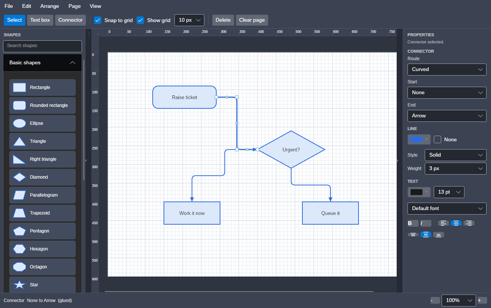

The panel shows what is in hand. Select a connector and it offers CONNECTOR, LINE and TEXT; a
connector has no fill, so there is no FILL section to ignore. Select a shape and FILL comes
back and CONNECTOR goes. Pick up the **Connector** tool with nothing selected and the connector
settings appear anyway, so the next connector can be set up before it is drawn.

**Curved is a way of drawing a route, not a way of finding one.** A curved connector is routed
exactly as a right-angled one is - the same clearances, the same glue, the same bends if you
have placed any - and only the turns between the runs are drawn differently. Anything a
right-angled connector would keep out of, a curved one keeps out of too.

A corner takes up to ten units of each run it joins, or half the run where the run is shorter
than that, so a tight staircase of short runs stays legible instead of curling up into itself.
The curves are curves in the exported file as well, not a lot of short straight lines: SVG gets
a quadratic, and so do PDF, the pictures and Visio.


### Adjusting a connector by hand

Select a connector and it offers a grab point on each end, on every bend, and in the middle of
every straight run:

| Handle | What dragging it does |
|---|---|
| An end | Re-routes that end. Drop it on a shape to stick it there, or on the page to set it free |
| A bend | Moves that bend. Drop it back on the line between its neighbours and it is removed - the handle turns red first, so you can see it coming |
| A middle | Slides that run sideways, adding bends either side of it |

Double-clicking a bend also removes it. **Edit -> Reset connector route** hands a connector
back to the router and forgets everything you placed by hand.

### Joining a line to a line

A connector's end can be dropped on another **connector** as well as on a shape. Drag the end
over a line and let go: it sticks to the line at the point you dropped it, and stays there as
that line re-routes.

This is what a loop wants. A "no" branch coming back round to a check usually belongs on the
run that feeds the check rather than on the check itself - drawn to the box, it arrives
alongside every other line that ends there and the diagram stops saying which is which.

Where it lands is remembered as a fraction of the way along the line, not as a bend. Bends are
not fixtures: the router puts them in and takes them out as the shapes move, so a line hung off
a bend would be hung off something that may not be there next time. A fraction is always
somewhere on the line, and carries round a new corner with it.

The line being joined is routed first, so what hangs off it knows where to be. Two connectors
joined to each other have no answer between them and are left where they were drawn rather
than chasing one another.

One thing it costs: **Mermaid cannot write it down.** Mermaid joins nodes to nodes and has
nothing for a point partway along an edge, so a line joined to a line is left out of that
export, and the summary says so. Every other export draws it, because every other export draws
where things are rather than what connects to what.

### When bends are let go

Bends you place by hand are yours, and the router leaves them alone - even where its own route
would be shorter. A line taken the long way round is a line somebody meant to take the long way
round.

It cannot leave them alone for ever, because the page moves on around them. A bend sits at a
place on the page rather than at a place on a shape, so moving a shape, or turning one, pulls
the end of the line away from bends that have stayed where they were. What is left is a route
nobody chose.

So a hand-placed route is let go once either of these has become true of it:

- **It runs through a shape.** The line now crosses something it used to pass beside.
- **It has stopped turning square corners.** A right-angled connector is drawn in runs across
  and down, and dragging a bend keeps the angles either side of it square - there is no way to
  ask for a slanted run. One that appears is the distance between an end that has moved and the
  bends that have not.

The bends then go, and the connector routes itself again around whatever is now in the way.
What is lost is a route that had already stopped being the one you drew.

It is the direction a shape moves that decides this, not how far it goes. Moved along the line
it leaves by, it keeps its corners square however far it travels, and the bends stay. Moved
across that line, they go - a few units is enough, because the run that met the end square on
no longer does. Turning a shape swings its connection points round with it, which is enough on
its own.

This is for connectors that are routed - right-angle and curved alike. A straight connector
keeps whatever bends you give it, since there is no route for it to fall back on.

### Labelling a connector


Double-click a connector, or select it and press `F2`, and type. The words sit in a gap cut out
of the line, so they read cleanly whatever is behind them, and they land in the middle of the
longest straight run rather than on a bend.

Drag the label to move it off the line. What is remembered is how far you moved it, so it keeps
its place as the shapes move and the line re-routes beneath it. **Edit -> Reset connector
route** puts it back.

### Line ends

The **Start** and **End** pickers, in the CONNECTOR section of the properties panel, set what
each end of a connector looks like:
none, an arrow, an open arrow or a dot for ordinary use; a diamond, hollow diamond or hollow
arrow for UML; and the crow's foot family for entity-relationship diagrams. What you choose
becomes the default for the next connector you draw.

## Formatting

The properties panel down the right formats everything selected at once.

| Section | What it sets |
|---|---|
| FILL | The colour inside a shape, from a palette or a hex value, or None for no fill at all - and a fade to a second colour |
| LINE | The outline colour or None, the style - solid, dashed or dotted - and the weight |
| TEXT | The colour, size, font, bold, italic and alignment of the label |

There are two rows of alignment buttons: the first puts the label to the left, the centre or
the right of its shape, the second puts it at the top, the middle or the bottom.

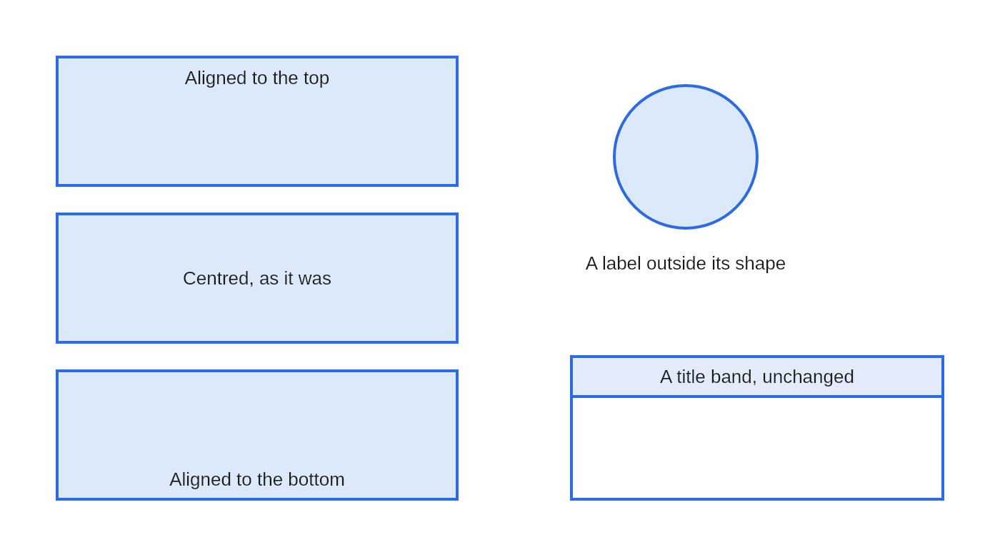

## Moving a label off its shape

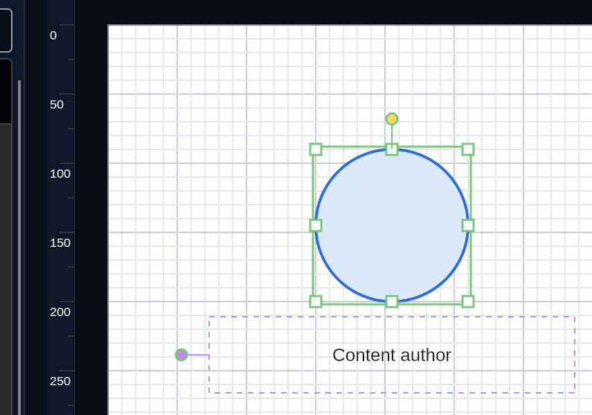

A label can also leave its shape altogether - a name under a figure, or a caption beside a box.

Select a shape that has a label and a small round **grip** appears out to its side, on a stalk.
Drag it and the label goes with it; a dashed box shows where the words are being wrapped. The
shape itself stays where it is - the grip is off to the side precisely so that taking hold of
the middle of a shape still moves the shape.

Once a label has a block of its own, the block has **corners**. Drag one to make it wider or
taller - which is how a label taken off a narrow shape stops wrapping to that shape's width.

**Edit -> Reset label position** puts the whole thing back in the middle.

A label that has been moved stays with its shape: move the shape and the label follows, resize
it and the label moves and stretches in proportion, turn it and the label swings round with it.
It is saved with your drawing and it survives a trip out to Visio and back.

While the block is still the shape, its corners sit a little outside the shape's own so that
you can grab either; once the label has been moved they sit on the block itself.

Where the selected shapes disagree, a control shows a dash rather than pretending they match;
choosing something then applies it to all of them. With nothing selected the panel sets the
formatting for the next shape you draw.

## Aiming a callout

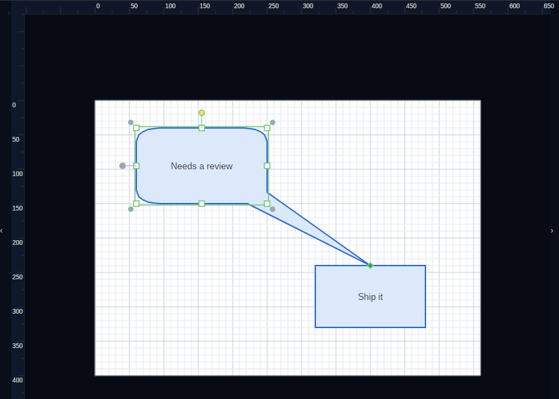

A callout is a bubble with a tail, and the tail is the point of it - a callout that cannot be
aimed is only a box with a spike on it.

Select a speech bubble, oval callout, rectangular callout or thought bubble and a small
**diamond** appears on the tip of its tail. Drag it and the tail follows, out to wherever you
want the callout to be pointing. The bubble itself stays where it is and keeps its whole box
for the words; only the tail moves.

Drop the tip on another shape's **connection point** and the tail is pinned there. The diamond
turns green to say so, and from then on the tail follows that shape: move it across the page,
resize it, turn it, and the callout stays aimed at the same point on it. This is the same snap
a connector uses, so you do not have to land exactly on the point - near enough will do.

Dropped anywhere else, the tail simply stays where you put it. It is held as a position
relative to the bubble, so it travels with the bubble as you move it and stretches with it as
you resize it.

Delete the shape a callout was pointing at and the callout is left pointing at the same spot
rather than springing back.

A thought bubble has no spike - it trails smaller bubbles instead - but its tail is aimed in
exactly the same way, and the trail follows.

Where a callout points is saved with your drawing, and aiming one is a single step to undo.

## Data behind a shape

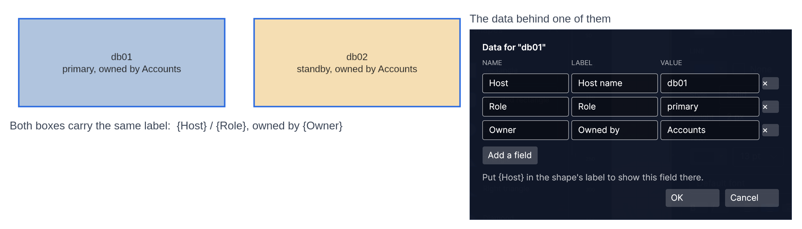

A shape can carry **data**: named fields with values. Select a shape and press `F4`, or use
**Edit -> Shape data...**, to see what it carries and to add, change or remove fields.

To put a field on the page, name it in the shape's label between braces. A label of

```
{Host}
{Role}, owned by {Owner}
```

draws as **db01 / primary, owned by Accounts** - and when you change the value, the label
changes with it. Both boxes in the picture have exactly that label; all that differs is the
data behind them.

Only a name that matches a field is replaced, so a label that happens to contain braces is
left alone. Case does not matter: `{host}` finds a field called `Host`.

A field has a **name** - what the label calls it - and can have a **label** of its own for
when the name is not what you would want to read, such as `Owner` in the text and "Owned by"
in the dialog.

The data belongs to the shape. It is saved with your drawing, and it travels to Visio and back:
a Visio drawing whose stencil defines fields arrives with those fields ready to fill in.

## Fades

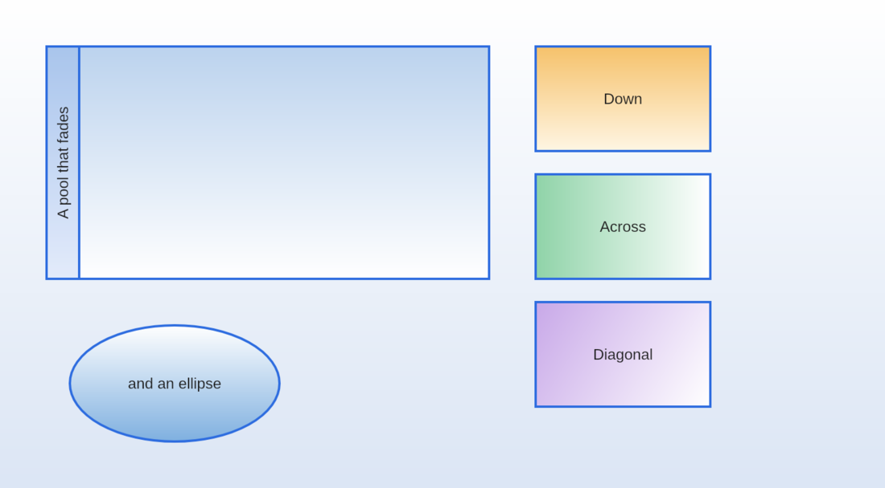

A shape can be filled with a **fade** that runs from one colour to another. Tick **Fade to** in
the properties panel, pick the second colour, and choose which way it runs: down, up, across,
back or diagonally. The fill colour you already had stays the near end, so turning the fade off
again leaves the shape as it was.

It works on pools, lanes and containers too, which is where it is most useful - a band of
colour at a lane's heading that thins out across the rest of it.

The **paper** can fade the same way, in **File -> Page setup**.

A shape's fade travels to Visio and back, and so does the paper. A Visio drawing that fades
through more than two colours keeps its two ends.

## Watermarks, headers and footers

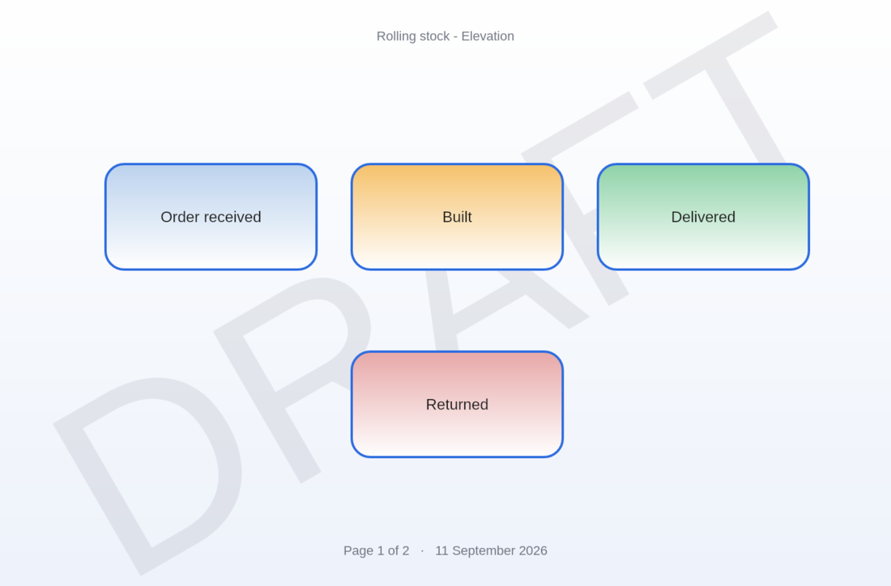

**File -> Page furniture...** puts words across the page and a line of text along the top and
the bottom.

None of it is a shape: you cannot click it, drag it or glue a connector to it. It belongs to the
page, so it stays where it is put.

A header or footer can be written with these in braces, and they are filled in as the page is
drawn:

| | |
|---|---|
| `{page}` | Which page this is |
| `{pages}` | How many pages there are |
| `{name}` | The page's name, as shown on its tab |
| `{date}` `{time}` | When it was drawn |

A footer of `Page {page} of {pages}` is therefore right on every page, and stays right when you
add, delete or reorder pages.

The watermark is drawn under your diagram so the diagram stays readable, and it is sized to
cross the page rather than set in points. Either the watermark or the header and footer can be
set on this page alone or on every page at once.

## Arranging

The **Arrange** menu works on a selection:

- **Align** lines shapes up on any of six edges, and **Distribute** spaces them evenly.
- **Make same size** sizes them all to whichever was selected last.
- **Bring to front**, **Bring forward**, **Send backward** and **Send to back** change what is
  drawn over what.
- **Rotate left**, **Rotate right** and **Straighten** turn shapes in right angles.
- **Lay out** arranges shapes in layers by the connectors between them, down the page or
  across it.

### Laying a drawing out

**Arrange -> Lay out** takes a drawing that has grown in whatever order you thought of things
and puts it in order. Everything a shape points at moves one layer further along, the layers
are spread out along the flow, and the shapes within each layer are shuffled to pull crossing
lines apart.

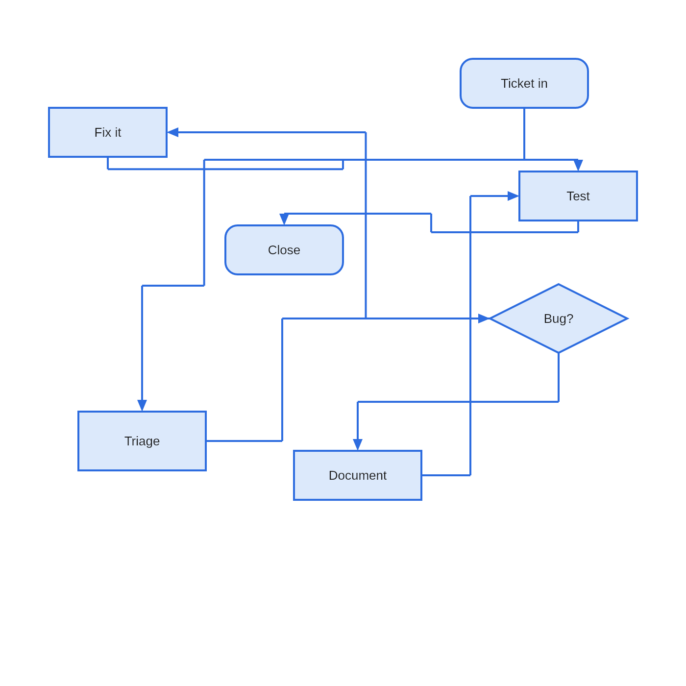

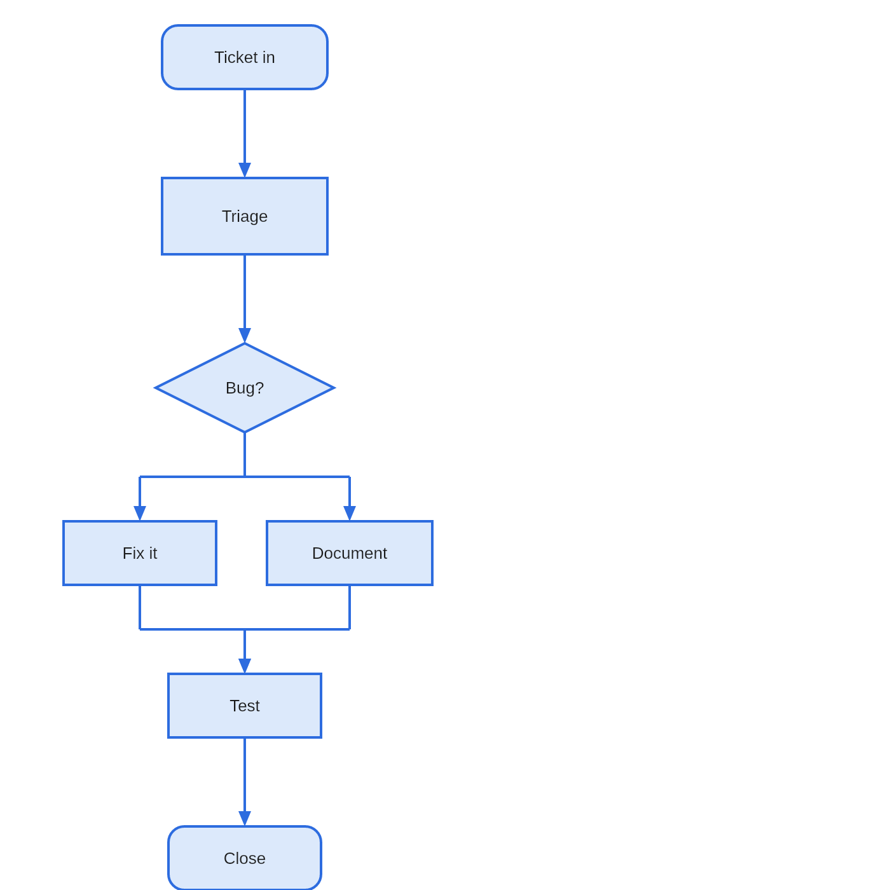

It works on the selection when there is one worth speaking of, and on the whole page when
there is not - tidying one drawing is the usual want, and selecting all of it first would be a
chore. It is one step on the undo history, so `Ctrl+Z` puts the sprawl back if you preferred it.

A few things worth knowing:

- **Only the shapes move.** The connectors are left to route themselves afterwards, which they
  do better than a layout pass could tell them to.
- **A drawing that loops is still laid out.** The line that closes the loop is the one drawn
  against the flow, which is what a reader expects of a loop anyway.
- **Shapes in a container are kept together.** Each container's members are laid out side by
  side rather than scattered along a layer by whatever they happen to be joined to, so the box
  drawn round them stays a box and not a band reaching across the page.
- **Pools and lanes are left alone**, and so is anything inside one. Which lane a shape sits in
  is part of what the drawing says, and moving it to another lane would change the meaning
  rather than the look.
- **The drawing stays where it was**, as near as it can. Laid out, a drawing is usually taller
  than the sprawl it came from, so it is slid back onto the paper where there is room for it.


For any angle, drag the round handle above a selected shape. Hold `Shift` while you drag to
snap to 15°.

## Guides and rulers


Three things help you line work up, and none of them constrains where a shape may go:

- **Rulers** run along the top and left, marked in page units, with a marker on each following
  your pointer. `View -> Rulers` folds them away.
- **Smart guides** line a dragged shape up with the edges and middles of the others when it
  comes close, and draw the line it caught on. `View -> Smart guides` turns them off.
- **The margin** is a dashed inset on the page, set in Page setup and off by default.

The **grid** still catches whichever direction nothing else lined up.

## Containers and swimlanes


A pool, a lane or a grouping box holds what you put into it:

- **Dropping a shape inside adopts it**, and dragging it out lets it go. The innermost
  container wins, so a shape dropped on a lane joins the lane rather than the pool around it.
- **Moving a container carries its contents.**
- **Lanes belong to their pool.** They follow when it is moved or resized, and dragging a lane
  reorders it among its siblings rather than moving it freely.
- **Drag the line between two lanes** to change their heights: one gains what the other gives
  up. **Arrange -> Even lane heights** puts them back on equal shares.
- **Deleting a container asks** whether to take the contents with it, or drop them on the page.

Only a container's title band and its border are clickable, so you can sweep a selection box
across its middle and drop things into it.

## Pages


A document holds as many pages as you like. They appear as tabs along the bottom of the drawing
area once there is more than one.

| To do this | Do that |
|---|---|
| Turn to a page | Click its tab, or `Ctrl+PageUp` and `Ctrl+PageDown` |
| Add a page | The `+` at the end of the tabs, or `Ctrl+Shift+P` |
| Rename one | Double-click its tab |
| Reorder | Drag the tab along the strip |
| Duplicate or delete | Right-click the tab |

Each page carries its own paper size, so one document can hold a portrait page, a landscape one
and an A5 note. Deleting a page with anything on it asks first.

## Page setup


**File -> Page set up** sets the paper the current page sits on, or every page at once. Pick
one of the six presets - Letter, Legal, Tabloid, A3, A4 or A5 - or type a width and height.
**Fit to the drawing** sizes the page to what is on it.

**Margin** draws a dashed inset to line work up against. It is a guide only: nothing is stopped
from being placed outside it, and nothing is clipped by it. Set it to 0 for none.

**Paper** is the colour the page is drawn on, and **Fade to** runs it into a second one - down,
up, across, back or diagonally, the same five directions a shape's own fill offers. Each page
carries its own paper, so one document can hold a white page, a tinted one and a page that
fades; **Apply to every page** sets them all at once. The colour goes out with the drawing in
every export that has somewhere to put it.

## Shapes of your own


**Edit -> Save selection as a shape** keeps whatever is selected under a name of your choosing.
It appears in **My shapes** at the top of the toolbox, and you place it like any other shape.
Right-click one to rename or delete it.


What comes back is what you saved: every shape, its colours, its font, the connectors between
them and their grouping. Group the selection before saving it if you want it to move as one
thing afterwards.

Saved shapes are kept with your settings rather than with a drawing, so they are there in every
document and every time you open the app.

## Saving and exporting

**Save** and **Open** use `.avadiag` files. That is the format to keep your work in: it holds
the pages, the glue between connectors and shapes, the grouping, the drawing order and every
colour and size you chose. Older files always open in newer versions.

**File -> Export** writes your drawing in seven other formats:

| Format | When to use it |
|---|---|
| SVG | Vector, for handing to another drawing tool |
| PDF | Vector, at the true physical page size, with the text still selectable. The one to print or attach. Offers all pages or just the one you are on |
| Visio | A modern `.vsdx` drawing, every page of the document in the one file |
| Mermaid | The page as a Mermaid `flowchart`, shown on screen to copy rather than saved |
| PNG | A picture, and the right answer nearly always. Choose 1x to 4x |
| JPEG | For where nothing else is accepted. A diagram is the worst case for it, so the quality default is high |
| WebP | Smaller than PNG at moderate quality |
| BMP | For tools that will take nothing else. A large file for the same picture |

Whichever you choose, what is exported is the page and only the page: white paper, no grid, no
selection handles and no workspace around it, whatever the screen happens to be showing.

## Mermaid

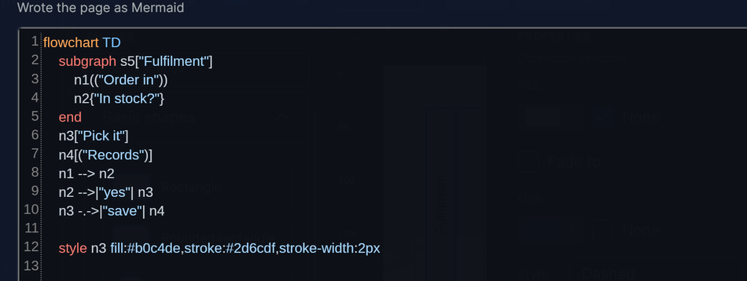

**File -> Export -> Mermaid...** turns the page into a Mermaid `flowchart` and shows it, coloured
and numbered, so you can copy it into a README, a wiki page or a pull request.

Mermaid works out the arrangement itself - there is no way to tell it where things go - so what
travels is what your diagram *means*: the boxes, their shapes, their words, what joins what, and
which boxes sit inside which container.

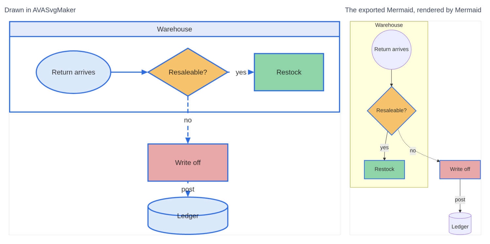

Those are the same diagram. Every shape kept its kind, its colour and its words, the dashed line
stayed dashed, and the container came through as a labelled box. What changed is where things
are: the three shapes drawn in a row across the top come out stacked, because Mermaid places
each one by how far along the chain of arrows it sits.

So a diagram that is a flow of steps travels well. One whose point is its arrangement - a floor
plan, a rack layout, a network drawn to match the building - does not, and SVG or PDF is what
you want for that.

Anything Mermaid has no room for - a turned shape, a fade, a loose text box, a page's watermark,
a connector that is not joined to shapes at both ends - is named in the message rather than
quietly dropped.

That last one is worth reading. A connector reported as joined to nothing was never really stuck
to the shapes it appears to touch, and would have come adrift as soon as one of them moved - so
the message is a way of checking a drawing as well as exporting it.

## Reading Mermaid in

**File -> Import -> Mermaid** takes a flowchart written as text and turns it into a drawing on
a page of its own. Paste it into the box - the clipboard is offered if it already looks like
one - and it arrives as shapes you can move about.

This, pasted in:

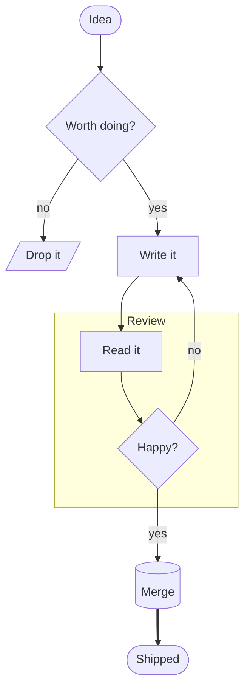

comes back as this:

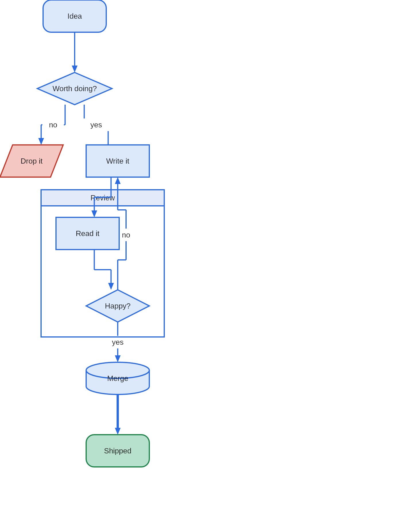

Mermaid says what connects to what and nothing at all about where anything is, so the shapes
are laid out on arrival by the same pass **Arrange -> Lay out** uses. Run that again afterwards
if you would rather have it across the page than down it.

What comes across:

- **The brackets round a label choose the shape** - `[box]`, `(rounded)`, `((circle))`,
  `{decision}`, `{{hexagon}}`, `[/leaning/]`, `[(barrel)]`, `[[twice]]`, `>a note]` and
  the stadium `([both ends])`.
- **The arrow says how the line is drawn.** `-->` gets an arrow, `---` gets none, `<-->` gets
  one at each end, `-.->` comes back dashed and `==>` comes back thick.
- **Words on a line**, written either `-->|like this|` or `-- like this -->`.
- **A subgraph becomes a container.** Its members are kept side by side while the page is
  being laid out, and the box is drawn round them once they have places.
- **`style` lines** set a shape's fill, line colour and line weight.

Fences and `%%` comments are ignored, so a block copied whole out of a README works. A
`sequenceDiagram` or anything else that is not a flowchart is left alone and says so.

## Importing SVG


**File -> Import -> SVG...** reads a drawing in as editable shapes, onto a page of its own so it
does not land on top of work you have already done.

Reading SVG is an interpretation, not a copy. SVG can say far more than this editor can hold,
so the importer takes what maps onto shapes with a fill, an outline and a label - shapes,
paths, curves, arcs, transforms, colours, dashes and text - and **tells you what it could not
take**, rather than leaving you to notice.

Gradients, patterns, filters, clipping and embedded images are the usual things it cannot bring
in. A drawing that opens with a rectangle the size of itself is painting its background, which
here is the page, so that is left behind too.

## Visio drawings

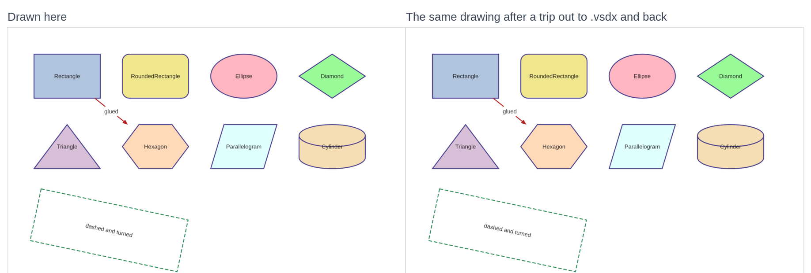

**File -> Import -> Visio drawing...** opens a modern `.vsdx`. Each page of the drawing arrives
as a page of its own here, so nothing lands on top of work you have already done.

Most shapes in a real Visio drawing carry no picture of their own: they say which *master* they
are a stamp of, and the master holds the geometry. The importer follows that all the way down,
including the common case of a shape that redraws only part of what it inherits, so what you
get is the drawing as Visio shows it rather than a page of empty boxes.

It reads pages and their sizes, shape outlines - straight edges, arcs, ellipses, curves and
splines - fills, line colours, weights and dash patterns, groups along with any turn or flip
the group itself has, connectors and which shapes each end is stuck to, and text with its size,
weight, slant, colour and alignment. It also reads the block the text sits in, which Visio
places separately and which need not be on the shape at all - so the name under a stick figure
arrives under the figure.

Whether a connector has an arrowhead on each end is read, though not which of Visio's forty-odd
line ends it is - those and the twelve here are different sets, so an end that is drawn comes in
as a plain arrow. A connector the drawing gives no arrowhead comes in without one.

Colours come through even when the drawing does not name them. A shape may leave its formatting
to a *style* - a named set the drawing keeps to one side, which may itself defer to another -
or to the current theme, and both are followed. Most of what you see in a Visio drawing is set
this way rather than on the shapes themselves.

Two things it cannot bring in:

- **A themed fill.** A themed *line* comes through. A themed *fill* is tinted by Visio in a way
  this does not read, so rather than paint the shape solid in its line colour it is left
  unfilled. A fill the drawing states outright comes in as it is.
- **Gradients, shadows, embedded pictures, layers and shape data.** Nothing here can hold them.

As with SVG, it **tells you what it left out** rather than leaving you to notice.

**File -> Export -> Visio...** writes one, every page of the document in the one file. Colours,
line styles, rotation, text and connector glue all go with it. Everything Visio would normally
look up in a stencil is written into the file itself, so it opens without needing one.

One thing worth knowing: the exporter was built to the published file format and its output is
read back and checked by this app, but it has not been opened in Visio itself - there is no
copy of Visio to try it with. If you have one, the result either way is worth reporting.

## Keyboard

| | |
|---|---|
| `Ctrl+N` `Ctrl+O` `Ctrl+S` `Ctrl+Shift+S` | New, Open, Save, Save As |
| `Ctrl+E` `Ctrl+Shift+E` | Export SVG, Export PNG |
| `Ctrl+Z` `Ctrl+Y` | Undo, Redo |
| `Ctrl+X` `Ctrl+C` `Ctrl+V` `Ctrl+D` | Cut, Copy, Paste, Duplicate |
| `Ctrl+A` | Select all |
| `Ctrl+,` | Preferences - theme, default formatting, grid and paper |
| `F4` | The data the selected shape carries |
| `Ctrl+G` `Ctrl+Shift+G` | Group, Ungroup |
| `Ctrl+Shift+F` `Ctrl+Shift+B` | Bring to front, Send to back |
| `Ctrl+]` `Ctrl+[` | Bring forward, Send backward |
| `Ctrl+Shift+P` | Add a page |
| `Ctrl+PageUp` `Ctrl+PageDown` | Previous page, Next page |
| `Ctrl+wheel` | Zoom about the pointer |
| `Ctrl++` `Ctrl+-` `Ctrl+0` `Ctrl+9` | Zoom in, out, actual size, fit the page |
| `F2` | Edit the label of the selected shape |
| `F9` `F10` | Fold the toolbox and properties panels away |
| Arrow keys | Nudge the selection by one grid cell |
| `Alt` + arrows | Nudge from anywhere in the window |
| `Delete` | Delete the selection, and any connectors glued to it |
| `Escape` | Back to the select tool |
| Middle-drag, or space and drag | Pan the page |

## Choosing a theme

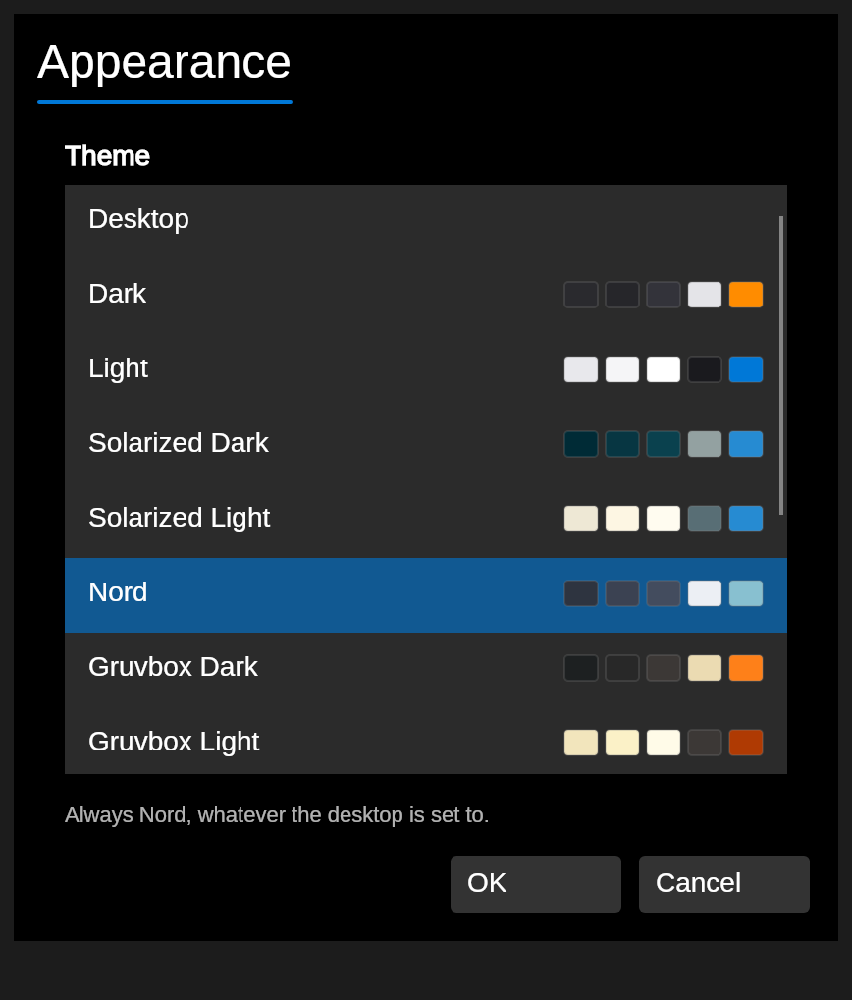

**Edit -> Preferences**, or `Ctrl+,`, opens the app's own settings. The first thing there is
the theme: the colours the toolbar, panels, rulers and status bar are drawn in.

There are thirteen to choose from - Dark, Light, Solarized, Nord, Gruvbox, Dracula, Tokyo
Night, Catppuccin and a high-contrast pair - and each row shows its own colours, because a
name is not much to go on. Click one and the window behind changes at once, so you can go down
the list and look. **Cancel** puts back whatever you had.

At the top of the list is **Desktop**, which means "use whatever the desktop is using". How
well that works is not up to the app:

- **Omarchy** publishes its whole palette and says when it changes, so the app re-colours the
  moment you switch themes.
- **Windows and macOS** say whether the system is light or dark, and say so again when it
  changes. You get the plain Light or Dark theme accordingly.
- **A plain Wayland or X11 session** - Hyprland, sway, i3 and most others - has nothing to
  say. The app cannot tell what you are running and will keep whatever it started with.

If you are on that last one, name a theme rather than leaving it on Desktop. That is what the
list is for.

Your choice is saved as soon as you make it, and is there the next time you open the app.

**The page itself never changes.** It is paper, and it is what your exports land on - a
diagram has to look the same to whoever you send it to. Only the frame around it is themed.

## Defaults for new shapes

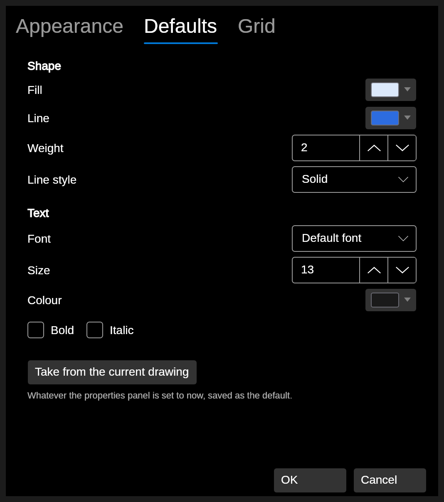

The **Defaults** tab of the same dialog holds the formatting every new shape is given: fill,
line colour, weight and style, then the font, its size and colour, and bold and italic.

This is not quite the same as the formatting boxes on the right of the window. Those set what
the *next* shape you draw will look like, which is handy while you are trying colours out - and
because it is handy, it does not touch your settings. Otherwise a few minutes of experimenting
would quietly change what the app opens with tomorrow.

When you do want what you have been using to become the default, the button says so: **Take
from the current drawing** copies whatever the properties panel is set to now into the
settings. It only goes that way when you ask.

Changing a default here does apply to the drawing you have open, so the next shape you draw
uses it straight away.

The **Grid** tab holds the grid size and whether snapping and the grid lines are on, and the
paper a **new** drawing starts on. That last one does not touch the drawing you have open -
use **File -> Page setup** for that.

## Fitting in

If you change the display scale while the app is open it will say so in the status bar rather
than half-applying it. Restart it to draw at the new scale.
