# AVASvgMaker User Guide

## Getting started

AVASvgMaker is a diagram editor. You drag shapes from the toolbox onto a page, label them, and
join them with connectors that route themselves around whatever is in the way.

There is nothing to install. Download the file for your machine from the releases page, unpack
it and run it: the .NET runtime and everything else it needs are inside the one file.

- On Linux and macOS the archive keeps the executable bit. If it goes missing on the way,
  `chmod +x AVASvgMaker`.
- macOS will want the file cleared from quarantine before it will open something downloaded
  from the web.

Your work is saved in `.avadiag` files. That is the format to keep drawings in - it holds
everything, including the things an exported picture cannot. Exports are for handing your
drawing to someone else.

## The window

Down the left is the **toolbox**, holding every shape you can draw, in categories that fold
away, with a search box at the top. Down the right is the **properties panel**, which formats
whatever is selected. In the middle is the **page**, floating on a workspace, with **rulers**
along the top and left edge and **page tabs** along the bottom once a document has more than
one page. The **status bar** at the foot tells you what is selected and what a drag is about
to do.

Both side panels fold away when you want the room: `F9` hides the toolbox, `F10` the
properties panel, or use the small arrows at their inner edges.

The **toolbar** above the page holds the things you reach for most: the three tools, the ends
and routing of connectors, the grid, and Delete.

## Drawing shapes

There are two ways to put a shape on the page, and both start in the toolbox:

- **Drag** the shape from the toolbox onto the page.
- **Click** the shape in the toolbox, then click the page where you want it. The toolbox item
  stays lit until you place it, so it is clear what a click is about to do.

Once a shape is on the page:

| To do this | Do that |
|---|---|
| Move it | Drag it |
| Resize it | Drag one of the eight handles round it |
| Turn it | Drag the round handle on the stalk above it |
| Label it | Double-click it, or select it and press `F2`, then type |
| Delete it | Select it and press `Delete` |

Positions and sizes snap to the grid, which you can switch off or resize from the toolbar.

### Selecting

Click a shape to select it. Hold `Shift` or `Ctrl` and click to add more, or sweep a box
across the page to take everything it encloses - the box takes what it fully surrounds, so you
can sweep across a large background shape without picking it up.

A selection of several shapes moves, stretches, restyles and deletes as one. Drag one of the
handles round it to stretch the whole lot, each shape keeping its place and size in proportion.

### Grouping

`Ctrl+G` makes one thing of two or more shapes. After that, clicking any member picks the whole
group, and it moves and resizes together. `Ctrl+Shift+G` breaks it up again, from any member.

Groups do not nest: grouping a group with something else makes one larger group.

## Text

Double-click any shape, or select it and press `F2`, and type its label. Press `Escape` or
click away to finish. For text with no shape behind it, use the **Text box** tool in the
toolbar and click the page.

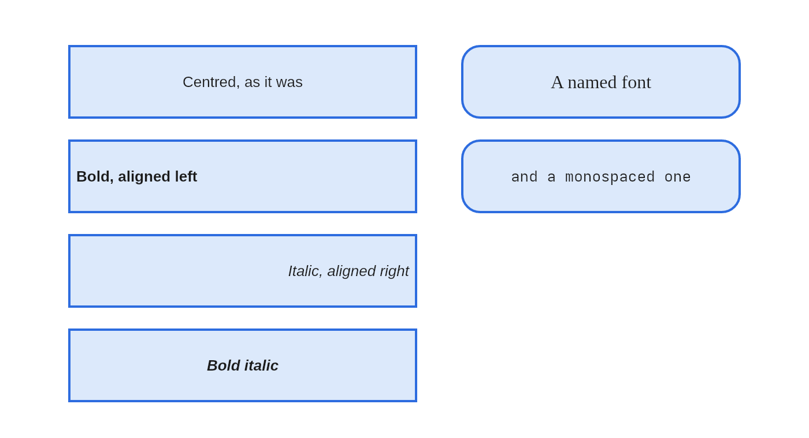

The TEXT section of the properties panel sets the colour, the size, the font, bold, italic, and
whether the label sits to the left, in the middle or to the right of its shape. The font list is
what is actually installed on your machine.

## Connecting shapes

Choose the **Connector** tool in the toolbar and drag from one shape to another. Each end snaps
to the nearest connection point, and sticks there: move either shape afterwards and the line
follows.

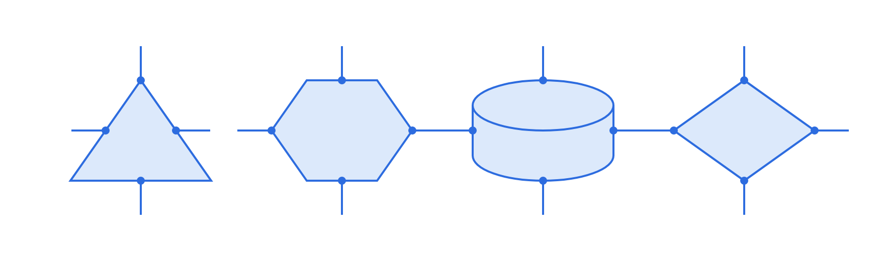

Every shape offers four connection points, and they sit on the shape itself rather than on the
box around it - a line meets a triangle on its sloping side and a cylinder on the curve of its
cap. They light up while you are drawing a connector.

**Route** in the toolbar chooses between a straight line and a right-angled one. A right-angled
connector keeps clear of the shapes in its way, and of the other connectors, and re-routes
itself whenever anything it depends on moves.

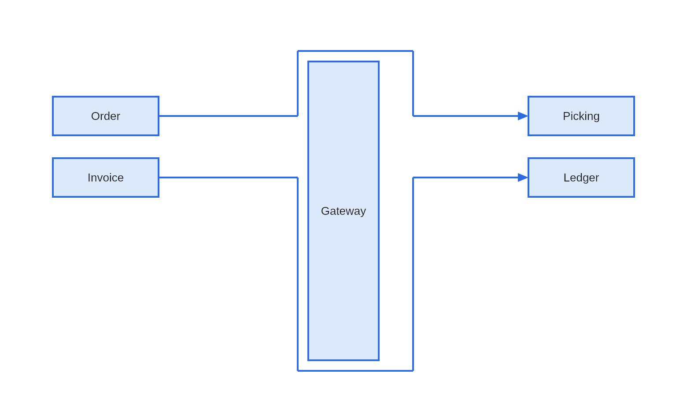

### Adjusting a connector by hand

Select a connector and it offers a grab point on each end, on every bend, and in the middle of
every straight run:

| Handle | What dragging it does |
|---|---|
| An end | Re-routes that end. Drop it on a shape to stick it there, or on the page to set it free |
| A bend | Moves that bend. Drop it back on the line between its neighbours and it is removed - the handle turns red first, so you can see it coming |
| A middle | Slides that run sideways, adding bends either side of it |

Double-clicking a bend also removes it. **Edit -> Reset connector route** hands a connector
back to the router and forgets everything you placed by hand.

### Labelling a connector

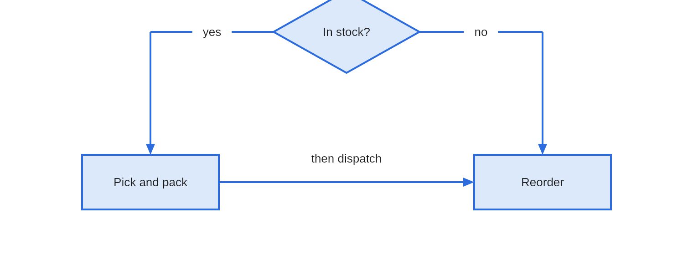

Double-click a connector, or select it and press `F2`, and type. The words sit in a gap cut out
of the line, so they read cleanly whatever is behind them, and they land in the middle of the
longest straight run rather than on a bend.

Drag the label to move it off the line. What is remembered is how far you moved it, so it keeps
its place as the shapes move and the line re-routes beneath it. **Edit -> Reset connector
route** puts it back.

### Line ends

The **Start** and **End** pickers in the toolbar set what each end of a connector looks like:
none, an arrow, an open arrow or a dot for ordinary use; a diamond, hollow diamond or hollow
arrow for UML; and the crow's foot family for entity-relationship diagrams. What you choose
becomes the default for the next connector you draw.

## Formatting

The properties panel down the right formats everything selected at once.

| Section | What it sets |
|---|---|
| FILL | The colour inside a shape, from a palette or a hex value, or None for no fill at all |
| LINE | The outline colour or None, the style - solid, dashed or dotted - and the weight |
| TEXT | The colour, size, font, bold, italic and alignment of the label |

Where the selected shapes disagree, a control shows a dash rather than pretending they match;
choosing something then applies it to all of them. With nothing selected the panel sets the
formatting for the next shape you draw.

## Arranging

The **Arrange** menu works on a selection:

- **Align** lines shapes up on any of six edges, and **Distribute** spaces them evenly.
- **Make same size** sizes them all to whichever was selected last.
- **Bring to front**, **Bring forward**, **Send backward** and **Send to back** change what is
  drawn over what.
- **Rotate left**, **Rotate right** and **Straighten** turn shapes in right angles.

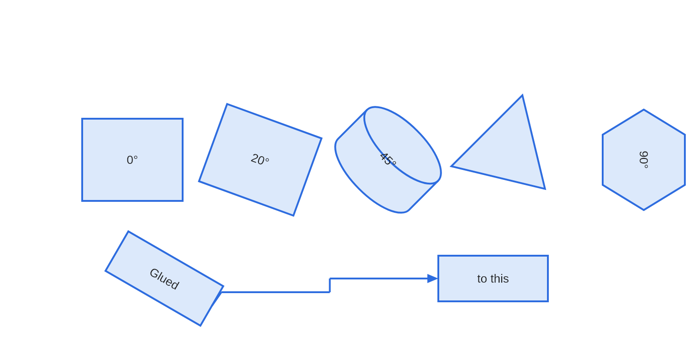

For any angle, drag the round handle above a selected shape. Hold `Shift` while you drag to
snap to 15°.

## Guides and rulers

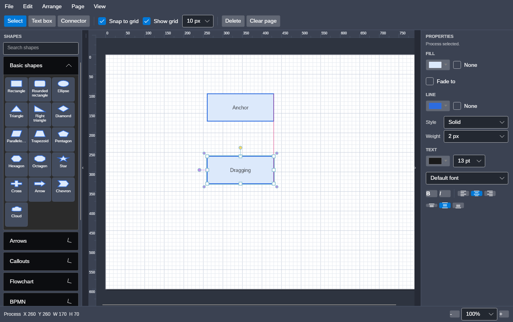

Three things help you line work up, and none of them constrains where a shape may go:

- **Rulers** run along the top and left, marked in page units, with a marker on each following
  your pointer. `View -> Rulers` folds them away.
- **Smart guides** line a dragged shape up with the edges and middles of the others when it
  comes close, and draw the line it caught on. `View -> Smart guides` turns them off.
- **The margin** is a dashed inset on the page, set in Page setup and off by default.

The **grid** still catches whichever direction nothing else lined up.

## Containers and swimlanes

A pool, a lane or a grouping box holds what you put into it:

- **Dropping a shape inside adopts it**, and dragging it out lets it go. The innermost
  container wins, so a shape dropped on a lane joins the lane rather than the pool around it.
- **Moving a container carries its contents.**
- **Lanes belong to their pool.** They follow when it is moved or resized, and dragging a lane
  reorders it among its siblings rather than moving it freely.
- **Drag the line between two lanes** to change their heights: one gains what the other gives
  up. **Arrange -> Even lane heights** puts them back on equal shares.
- **Deleting a container asks** whether to take the contents with it, or drop them on the page.

Only a container's title band and its border are clickable, so you can sweep a selection box
across its middle and drop things into it.

## Pages

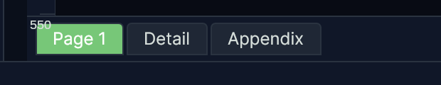

A document holds as many pages as you like. They appear as tabs along the bottom of the drawing
area once there is more than one.

| To do this | Do that |
|---|---|
| Turn to a page | Click its tab, or `Ctrl+PageUp` and `Ctrl+PageDown` |
| Add a page | The `+` at the end of the tabs, or `Ctrl+Shift+P` |
| Rename one | Double-click its tab |
| Reorder | Drag the tab along the strip |
| Duplicate or delete | Right-click the tab |

Each page carries its own paper size, so one document can hold a portrait page, a landscape one
and an A5 note. Deleting a page with anything on it asks first.

## Page setup

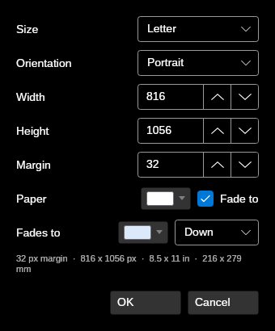

**File -> Page set up** sets the paper the current page sits on, or every page at once. Pick
one of the six presets - Letter, Legal, Tabloid, A3, A4 or A5 - or type a width and height.
**Fit to the drawing** sizes the page to what is on it.

**Margin** draws a dashed inset to line work up against. It is a guide only: nothing is stopped
from being placed outside it, and nothing is clipped by it. Set it to 0 for none.

## Shapes of your own

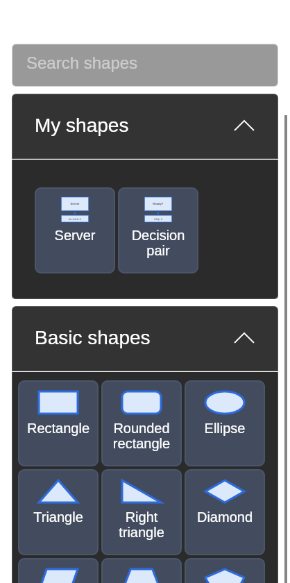

**Edit -> Save selection as a shape** keeps whatever is selected under a name of your choosing.
It appears in **My shapes** at the top of the toolbox, and you place it like any other shape.
Right-click one to rename or delete it.

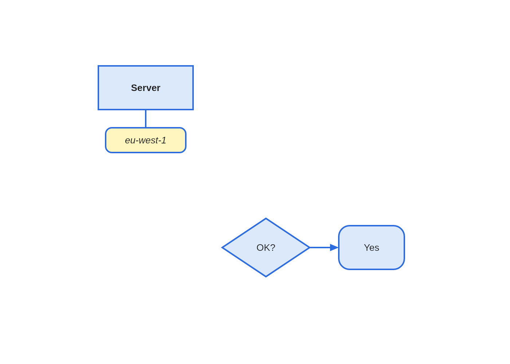

What comes back is what you saved: every shape, its colours, its font, the connectors between
them and their grouping. Group the selection before saving it if you want it to move as one
thing afterwards.

Saved shapes are kept with your settings rather than with a drawing, so they are there in every
document and every time you open the app.

## Saving and exporting

**Save** and **Open** use `.avadiag` files. That is the format to keep your work in: it holds
the pages, the glue between connectors and shapes, the grouping, the drawing order and every
colour and size you chose. Older files always open in newer versions.

**File -> Export** writes your drawing in six other formats:

| Format | When to use it |
|---|---|
| SVG | Vector, for handing to another drawing tool |
| PDF | Vector, at the true physical page size, with the text still selectable. The one to print or attach. Offers all pages or just the one you are on |
| PNG | A picture, and the right answer nearly always. Choose 1x to 4x |
| JPEG | For where nothing else is accepted. A diagram is the worst case for it, so the quality default is high |
| WebP | Smaller than PNG at moderate quality |
| BMP | For tools that will take nothing else. A large file for the same picture |

Whichever you choose, what is exported is the page and only the page: white paper, no grid, no
selection handles and no workspace around it, whatever the screen happens to be showing.

## Importing SVG

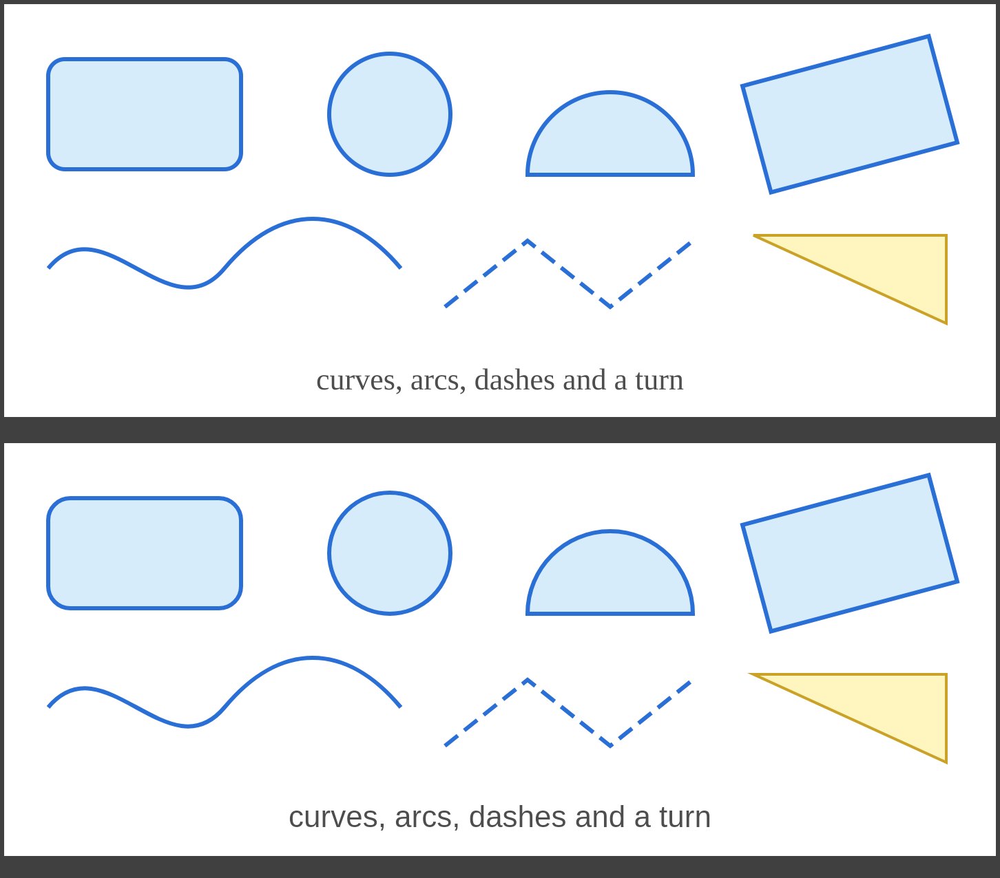

**File -> Import SVG** reads a drawing in as editable shapes, onto a page of its own so it does
not land on top of work you have already done.

Reading SVG is an interpretation, not a copy. SVG can say far more than this editor can hold,
so the importer takes what maps onto shapes with a fill, an outline and a label - shapes,
paths, curves, arcs, transforms, colours, dashes and text - and **tells you what it could not
take**, rather than leaving you to notice.

Gradients, patterns, filters, clipping and embedded images are the usual things it cannot bring
in. A drawing that opens with a rectangle the size of itself is painting its background, which
here is the page, so that is left behind too.

## Keyboard

| | |
|---|---|
| `Ctrl+N` `Ctrl+O` `Ctrl+S` `Ctrl+Shift+S` | New, Open, Save, Save As |
| `Ctrl+E` `Ctrl+Shift+E` | Export SVG, Export PNG |
| `Ctrl+Z` `Ctrl+Y` | Undo, Redo |
| `Ctrl+X` `Ctrl+C` `Ctrl+V` `Ctrl+D` | Cut, Copy, Paste, Duplicate |
| `Ctrl+A` | Select all |
| `Ctrl+G` `Ctrl+Shift+G` | Group, Ungroup |
| `Ctrl+Shift+F` `Ctrl+Shift+B` | Bring to front, Send to back |
| `Ctrl+]` `Ctrl+[` | Bring forward, Send backward |
| `Ctrl+Shift+P` | Add a page |
| `Ctrl+PageUp` `Ctrl+PageDown` | Previous page, Next page |
| `Ctrl+wheel` | Zoom about the pointer |
| `Ctrl++` `Ctrl+-` `Ctrl+0` `Ctrl+9` | Zoom in, out, actual size, fit the page |
| `F2` | Edit the label of the selected shape |
| `F9` `F10` | Fold the toolbox and properties panels away |
| Arrow keys | Nudge the selection by one grid cell |
| `Delete` | Delete the selection, and any connectors glued to it |
| `Escape` | Back to the select tool |
| Middle-drag, or space and drag | Pan the page |

## Fitting in

On Omarchy the app takes its colours from the current desktop theme and re-colours the moment
you switch, falling back to the palette it ships with everywhere else. The page itself always
stays white: it is paper, and it is what your exports land on.

If you change the display scale while the app is open it will say so in the status bar rather
than half-applying it. Restart it to draw at the new scale.
